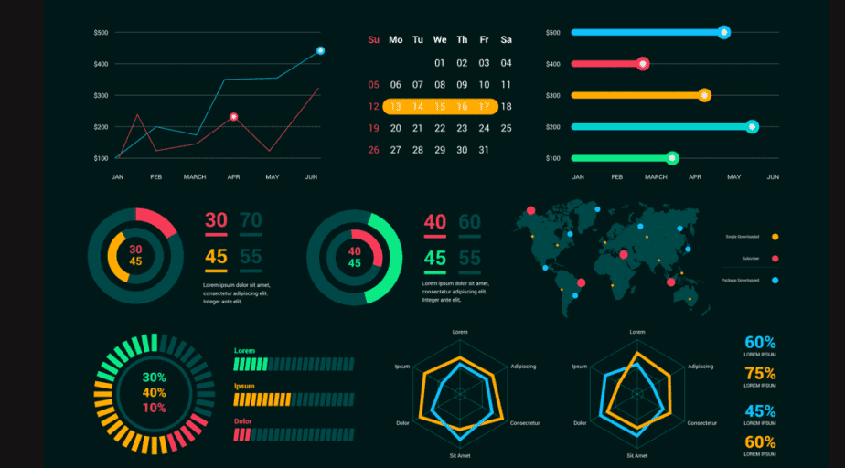

```{r setup, include=FALSE}
knitr::opts_chunk$set(echo = TRUE)
```


<style>
table {
background-color:#FFFFFF;
}
</style>

<style>
.list-group-item.active, .list-group-item.active:focus, .list-group-item.active:hover {
    background-color: darkblue;
}
</style>

<button onclick="document.body.scrollTop = document.documentElement.scrollTop = 0;" style="
    position: fixed;
    bottom: 5px;
    right: 40px;
    text-align: center;
    cursor: pointer;
    outline: none;
    color: #fff;
    background-color: #0A71A0;
    border: none;
    border-radius: 15px;
    
">Ir arriba</button>


El presente tema abarca la Introducción del R-Shiny, o Shiny. 

Se abordarán los siguientes temas:


- Compartir proyectos.
- Programas para compartir proyectos.
- ¿Qué es el Shiny?
- El R Shiny y sus diferentes modalidades y alcances.


Al finalizar la sesión, tendrá una noción más exacta del R-Shiny y su alcance dentro del ambiente de R.


# 1. Compartir proyectos. 

¿Por qué deberíamos pasar de un ambiente local a ambiente web?

Los siguientes son argumentos tomados del **USGS** (*Science for a changing world*)

El intercambio de datos, aplicaciones, o cualquier proyecto de información beneficia al investigador, a los patrocinadores de la investigación, a los repositorios de datos, a la comunidad científica, a las instituciones públicas, y al público en general. Se fomenta una mayor conexión y colaboración entre las personas involucradas, y una mejor ciencia conduce a una mejor toma de decisiones.

Compartir proyectos de datos puede tener su beneficio en término de:

- Sinergia
- Colaboración
- Mejoras científicas y de toma de decisiones 
- Inquietudes y consideraciones
- Mejores prácticas (documentación, almacenamientos de datos, descubrimientos).

Veamos cada una de las anteriores:

## Sinergia


Antes, ¿entendemos la palabra sinergia?

Hay beneficios inherentes del intercambio de datos para el investigador, la instituciones, y cualquier que sea el partidario. Hacer que los datos estén disponibles para sus pares y el público incentiva a los investigadores, los admistrativos, y otros, a administrar mejor sus datos y garantizar que sus datos sean de alta calidad. Los patrocinadores de la investigación pueden beneficiarse de los datos compartidos al estimular el interés y movilizar la investigación continua dentro de su campo científico. Por lo tanto, el intercambio de datos puede ayudar a aumentar el reconocimiento y la prominencia tanto del investigador como del patrocinador de la investigación.

Por parte de las instituciones públicas, permite una mejor conexión con las partes, y un aumento de la transparencia, eficiencia y mejora en los procesos en los que esté involucrado el proyecto. Las autorquías no presenta beneficio alguno para las instituciones. 

## Colaboración


El intercambio de datos fomenta una mayor conexión y colaboración, lo que puede dar como resultado nuevos hallazgos importantes. En una época de inversión monetaria reducida para la ciencia y la investigación, el intercambio de datos es más eficiente porque permite compartir los recursos.

El intercambio de datos permite aprovechar el trabajo de otros en lugar de repetir acciones ya existentes. Compartir datos también permite realizar metanálisis sobre el tema de investigación actual. Los metanálisis son importantes para recopilar tendencias más amplias en un área regional o temática más amplia. Por lo tanto, el intercambio de datos garantiza la producción continua de este tipo de análisis.

## Mejoras científicas y de toma de decisiones 

Compartir datos o proeyctos con datos aumenta la circulación y el uso de datos dentro de la comunidad  al fomentar una mayor transparencia, permitir la reproducibilidad de los resultados e informar a la comunidad  en general. Esto, a su vez, puede beneficiar enormemente al público, ya que una información mejor y más ampliamente difundida puede conducir a una toma de decisiones informada para la planificación y las políticas de toma de decisión.

## Inquietudes y consideraciones

A pesar de los muchos beneficios que se obtienen al compartir datos, existen consideraciones importantes que se deben tener en cuenta al compartir la información. Existe la preocupación de que otros utilicen los datos de manera inapropiada o fuera de contexto del propósito original de la investigación. Además, los datos pueden contener información confidencial y las aprensiones sobre el mantenimiento de la confidencialidad son razonables.

Por último, también pueden sentirse incómodos ante la perspectiva de no recibir el reconocimiento de otros que usan sus datos, o de que otros usen sus datos para obtener una ventaja competitiva. Si bien estas son preocupaciones válidas, a menudo mantener buenas prácticas de intercambio de datos y escribir metadatos completos puede abordar en gran medida muchos de estos problemas.

## Mejores prácticas (documentación, almacenamientos de datos, descubrimientos).

*Documentación:* Describa el contenido de los datos y el proceso a fondo.

- Una documentación buena y clara facilitará que otros vean sus datos, comprendan su contenido y fomenten la colaboración.
- Cree metadatos sólidos [consulte Describir > Metadatos para obtener más información].
- Defina claramente el propósito de la investigación y cualquier advertencia sobre los datos.
- Incluya cualquier problema de seguridad o confidencialidad relacionado con los datos.
- Describa los atributos, la geografía y el período de tiempo de los datos.
- Incluya vínculos asociados con los datos, como sitios web y repositorios de proyectos, para ubicar los datos en un mejor contexto.
- Especifique una cita de datos requerida para fines de reconocimiento.
- Cree una segunda versión de los datos accesible al público pero que contenga descripciones de datos generalizadas.
- Invite a otros contribuyentes de datos a revisar sus metadatos para garantizar la precisión.
 
*Almacenamiento de datos:* permitir una fácil ubicación y acceso a los datos los hace más fáciles de compartir.

- Almacene los datos en un repositorio al que se pueda acceder fácilmente [consulte Conservar > Repositorios para obtener más información].
- Incluya información de archivo y de referencia.
- Utilice citas de datos con el formato adecuado para los datos y todas las demás fuentes.
- Utilice identificadores persistentes (p. ej., identificadores únicos universales, UUID).
- Seleccione un formato para los datos destinados a largo plazo.
es decir, los archivos de texto ASCII se podrán leer durante un período de tiempo más largo que los archivos de la versión Excel 2000.
 
*Descubrimiento:* ponerlo ahí fuera.

- Haga que los datos sean reconocibles mediante la publicación de sus metadatos en portales de datos y cámaras de compensación [consulte Publicar/Compartir > Catálogos de datos para obtener más información].
- Anuncie los datos en línea a través de las redes sociales y los blogs.
  - Utilice palabras clave y etiquetas específicas que aumenten la probabilidad de que los datos se encuentren en los motores de búsqueda.


## En conclusión

En muy recomendable crear proyectos para compartir los datos y la información para el progreso continuo. 


# 2. Programas para compartir proyectos.

El compartir proyectos posee dos vertientes: 

A. Los archivos o la información
B. La visualización de la información.

En nuestro caso, hablaremos más de compartir la  visualización de la información o de los datos. Sin embargo, hablar sobre programas que administran y 
comparten la información inicial, también es una parte importante de un proyecto de datos o información.

Volvamos a analizar el flujo de la información:


Los fines de este curso en presentar la visualización de la información, y será mediante los Dashboards.

## Programas para la visualización de la información

Una lista del sitio web *simplileard.com*, presenta el top 15 de los herramientas para la visualización del información para este 2022:

1. Tableau
2. Dundas BI
3. JupyteR
4. Zoho Reports
5. Google Charts
6. Visual.ly
7. RAW
8. IBM Watson
9. Sisense
10. Plotly
11. Data Wrapper
12. Highcharts
13. Fusioncharts
14. Power BI
15. QlikView Plubisher.

En el siguiente enlace pueden verificar los pros y los contra de cada herramienta: https://www.simplilearn.com/data-visualization-tools-article

Uds se estarán preguntando: 

¿Y el R-Shiny?

Pues si, no está, pero me creearán que en la lista hay tres herramientas (JupyteR, Plotly y Highcharts), que se integran al Shiny.

Sucede que el Shiny no es tan intuituvo como los presentes en la lista, pero, a criterio personal, visualmente puede ser tan bello como los anteriores,
y es increíblemten poderoso. 



# 3. ¿Qué es el Shiny?  El R Shiny y sus diferentes modalidades y alcances


¿Qué es Shiny (R)?


Shiny es un paquete de R que permite crear aplicaciones web interactivas que pueden ejecutar código R en el backend (¿sabemos qué es el backend ?). Con Shiny, puede alojar aplicaciones independientes en una página web, incrustar gráficos interactivos en documentos R Markdown o crear paneles. También puede ampliar sus aplicaciones Shiny con temas CSS, widgets HTML y acciones de JavaScript.


Shiny le permite escribir potentes aplicaciones web interactivas completamente en R. Con R, crea una interfaz de usuario y un servidor, y Shiny compila su código en HTML, CSS y JavaScript, lenjuages  necesarios para mostrar su aplicación en la web. 

Dado que la aplicación ejecuta código R en el backend, puede realizar cualquier cálculo R que pueda ejecutar en su escritorio. Tal vez desee que su aplicación corte y divida un conjunto de datos en función de las entradas del usuario. O tal vez desee que su aplicación web ejecute modelos lineales o métodos de aprendizaje automático en datos seleccionados por el usuario. En tales casos, Shiny puede ayudar.


El marco web Shiny fundamentalmente permite recopilar valores de entrada de una página web, hacer que esas entradas estén fácilmente disponibles para la aplicación en R y tener los resultados del código R escritos como valores de salida en la página web. En su forma más simple, una aplicación Shiny requiere una función de servidor para realizar los cálculos y una interfaz de usuario. Las aplicaciones brillantes tienen dos componentes, una definición de interfaz de usuario y un script de servidor.


Lo más cool del Shiny es su programación reactive ...!

Shiny viene con una biblioteca de programación reactiva que utiliza para estructurar la lógica de su aplicación. Al usar esta biblioteca, cambiar los valores de entrada naturalmente hará que las partes correctas de su código R se vuelvan a ejecutar, lo que a su vez hará que se actualicen las salidas modificadas. El modelo de programación reactiva elimina la necesidad de un código de manejo de eventos adicional.

En Shiny, hay tres tipos de objetos en la programación reactiva: fuentes reactivas, extremos reactivos y conductores reactivos.

Fuentes reactivas y puntos finales: la estructura más simple de un programa reactivo implica solo una fuente y un punto final. En una aplicación Shiny, la fuente suele ser la entrada del usuario a través de una interfaz de navegador. Por ejemplo, cuando selecciona un elemento, escribe una entrada o hace clic en un botón, estas acciones establecerán valores que son fuentes reactivas. Un punto final reactivo suele ser algo que aparece en la ventana del navegador del usuario, como un gráfico o una tabla de valores.
Conductores reactivos: es posible colocar componentes reactivos entre las fuentes y los puntos finales. Los conductores reactivos pueden ser útiles para encapsular operaciones lentas o computacionalmente costosas.

Y si, tal vez, lo anterior fue muy complicado, pero lograrán entender la mecánica.

Ahora, ¿tienen ganas de aprender Shiny?

El curso es para ud !


# 5. Referencias

Sitios web de consulta:

- https://www.usgs.gov/data-management/why-share-your-data
- https://www.nature.com/articles/d41586-019-01506-x
- https://www.pcmag.com/news/10-free-data-visualization-tools 
- https://www.simplilearn.com/data-visualization-tools-article
- https://www.dominodatalab.com/data-science-dictionary/shiny-in-r

