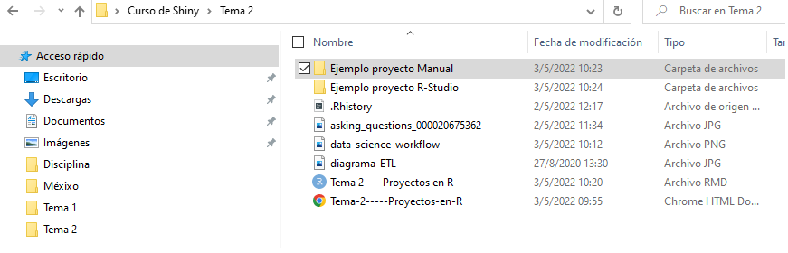
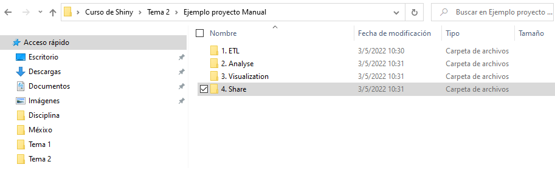
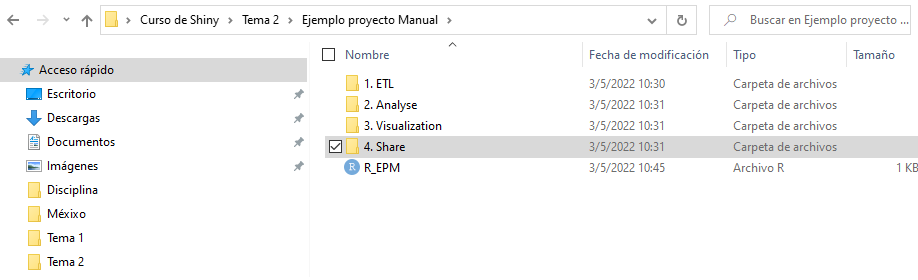
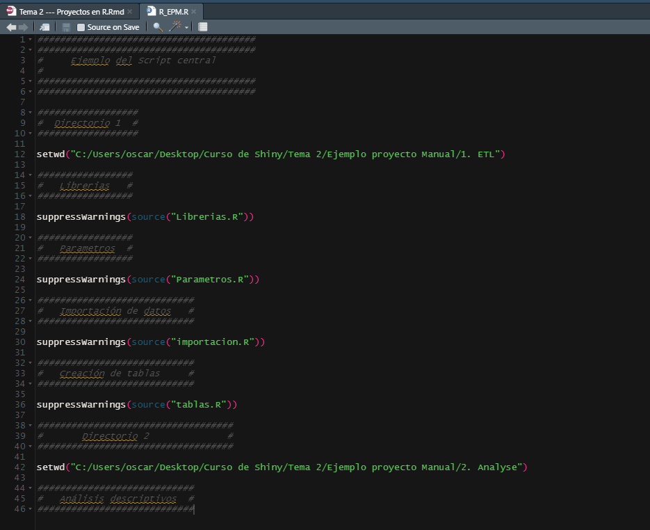
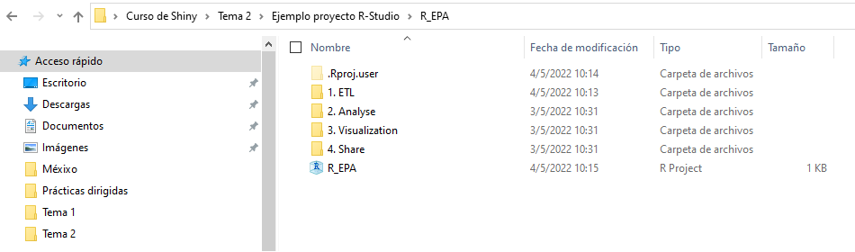
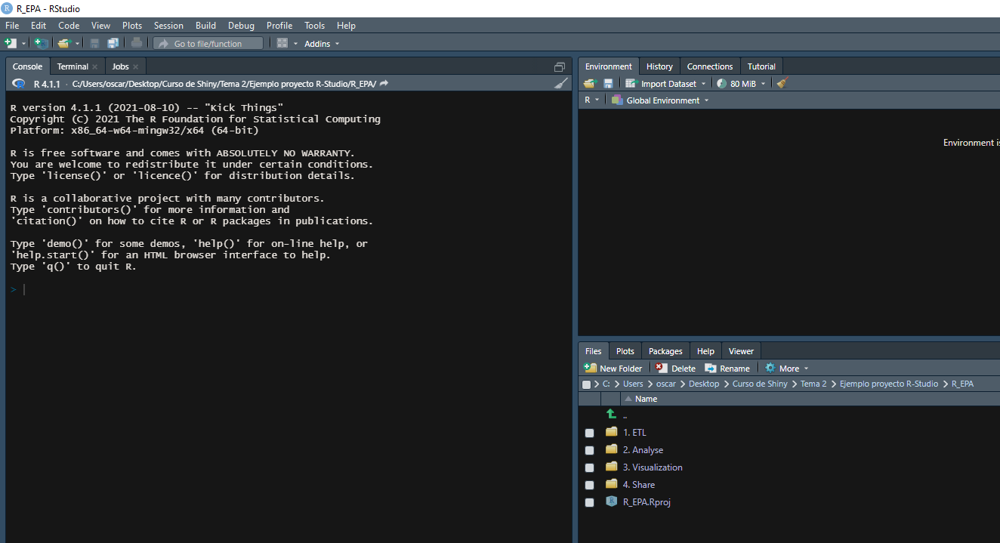

```{r setup, include=FALSE}
knitr::opts_chunk$set(echo = TRUE)
```


<style>
table {
background-color:#FFFFFF;
}
</style>

<style>
.list-group-item.active, .list-group-item.active:focus, .list-group-item.active:hover {
    background-color: darkblue;
}
</style>

<button onclick="document.body.scrollTop = document.documentElement.scrollTop = 0;" style="
    position: fixed;
    bottom: 5px;
    right: 40px;
    text-align: center;
    cursor: pointer;
    outline: none;
    color: #fff;
    background-color: #0A71A0;
    border: none;
    border-radius: 15px;
    
">Ir arriba</button>


El presente tema abarca la creación de proyectos en R.  

Se abordarán los siguientes temas:


- ¿Cómo es que suele organizar su Script o Markdown en R?
- Todo el código en un solo Script: ¿por qué no es siempre lo más recomendable?
- Crear un proyecto de forma manual.
- Los proyectos en R.
- La función **source()** en R. 


Al finalizar la sesión, tendrá una noción de por qué a veces es mejor tratar con proyectos que con Scrips individuales. Será de mucha 
utilidad a la hora llevar su proyecto de R-Shiny.

¿Por qué?

Eso lo veremos más adelante...

# 1. Organización de los Scripts o Markdown en R. 

Sin pena, ni tapujos, les quisiera preguntar:

¿Cómo es que suele organizar su Script o Markdown en R? 


Pues bien, antes de iniciar en el mundo de crear Dashboards con R Shiny, solía poner todo mi código en un solo script o un solo Markdown. ¿Solia ser lo adecuado?

Aún lo suelo realizar, dependiente de la labor que tenga que llevar a cabo. Pero cuando voy a trabajar en un proyecto Shiny, debo crear un proyecto de R Studio, ya sea manual, o el que R Studio nos ofrece.

Más adelante veremos cada una de estas modalidades. 

Sin embargo, nuevamente les haré otra pregunta:

¿Han tenido que crear un script en R, con más de 3000 ó 5000 líneas? ¿Y, al buscar dentro del mismo, no es a veces complicado?

# 2. Un solo Script: ¿por qué no es siempre lo más recomendable?

Veamos el siguiente enlace, en donde un usuario de R hace la siguiente pregunta:

*Question on managing long and heavy R code (one script VS multiple pieces)*

(https://community.rstudio.com/t/question-on-managing-long-and-heavy-r-code-one-script-vs-multiple-pieces/11917)

Es un foro en donde diversos usuarios de R expresan su opinión y consejos para lidiar con scripts en R muy extensos...  

Ahora, vemos un caso similar pero desde Python: 

*Is it better to have multiple files for scripts or just one large script file with every function? *

https://stackoverflow.com/questions/54349902/is-it-better-to-have-multiple-files-for-scripts-or-just-one-large-script-file-wi

De igual forma, los usuarios expresan y comparten su opinión sobre estrategias sobre si es mejor un sólo código, o tener una estructura
con diversos **.py** para llevar a cabo su código.

¿Qué creen que se expresa en dichos foros?

Los invito a leerlos... 

Sin embargo, al trabajar con proyectos muy, pero muy extensos, en donde se poseen diversas etapas, hay una fuerte recomendación a separar los scripts (.R, .rmd, .py, etc.), en varios, y así facilitar la labor a la hora de programar.

Esto se dice sobre un proyecto en JavaScript:

**Should I separate JavaScript files?**  

**You should put your JS code in a separate file because this makes it easier to test and develop. The question of how you serve the code is a different matter. Serving the HTML and the JS separately has the advantage that a client can cache the JS.**

Para nuestro caso, recordemos que un proyecto de datos, suele tener la siguiente forma:


Bajo este concepto, siempre veremos que este está compuesto de:

1. Extracción de los datos (Acquire). 
2. Transformación de la data (Prepare).
3. Creación del o los conjuntos de datos que necesitamos (Prepare).
4. Análisis primario de los datos, o estadísticas descriptivas (Explore).
5. Creación de modelos de análisis de datos (Analyse).
6. Visualización de los resultados.

Mediante el Shiny, se crea un 7 paso:

7. Compartir los resultados a los usuarios.

Aunque este tema no aborda aún este punto, al tener tantas etapas para un proyecto Shiny, es importarte crear y organizar el código en un proyecto.


# 3. Crear un proyecto de forma manual.

Para crear proyectos de forma manual, lo que se debe hacer es crear una carpeta central, en donde esté el proyecto a construir:


Para este caso, vean que el proyecto manual estará en la carpeta "Ejemplo proyecto Manual"

Una vez creada la carpeta central, es recomendable tener carpetar separadas en donde se pongan las etapas que desean diferencias o separar.

Por ejemplo, se desean para el presente caso crear 3 etapas:

1. Extracción y creación de las tablas
2. Análisis de la información.
3. Visualización de la información.
4. Compartir la información

Así es como se verá:


Surge la pregunta:

¿Pero qué código es el que retoma todas las diferentes partes y une los procesos?

Pues bien, en la carpeta raíz de "Ejemplo proyecto Manual", se puede crear un script .R (si, no soy muy amante de los .rmd, porque son más lentos en proceso encadenados...), y ese Script central .R, suele recoger lo que debería de suceder en las distintas etapas del proyecto.


Excelente !

La gran pregunta, que debería surgir, ¿mediante que comando podemos tantos adentrarnos a los etapas del proyectos y darle "run" o desencadenar los códigos?

##  La función **source()** en R.

La función héroe es *source()*, la cual nos permite lo anterior.



Mediante la función *source()*, se complilan los scripts que permiten:

- Cargar las librerías.
- Cargar parámetros esecenciales para el análisis.
- Importar los datos.
- Crear los tablas o los marts necesarios para el análisis
- Etc.

Lo único si sería entonces complicar el código central, en este caso, el  **R_EPM.R**

¿No les parece cool?

# 4. Los proyectos en R

R Studio, por supuesto permite crear proyectos para así tener un ambiente más amigable y llevadero para el usuario. Para entender los pros 
de tener un proyecto, los invito a leer el siguiente enlace: **Setting up a reproducible project**

https://alexd106.github.io/intro2R/project_setup.html

Para crear un proyecto, debemos posicionarnos en 

File ---> 
          New Project
          
Y de ahí, sigan los siguientes pasos:

1. Crear nuevo directorio:


2. Crear un nuevo proyecto:


3. Poner un nombre al directorio:

 

Una vez que haya creado su nuevo proyecto, ahora tendrá una nueva carpeta en su computadora que contiene un proyecto de RStudio.

Este archivo .Rproj contiene varias opciones de proyecto (pero en realidad no debería interactuar con él) y también se puede usar como acceso directo para abrir el proyecto directamente desde el sistema de archivos (simplemente haga doble clic en él). Puede verificar esto en la pestaña 'Archivos' en RStudio (o en Finder si está en una Mac o File Explorer en Windows).

 

Al darle doble click, verá que una nueva pestaña de R se despliega, con el proyecyto con extensión .Rproj, y en este caso con las etapas del proyecto de datos.

 

Ahora si! Creamos el proyecyto en R, donde podemos crear carpetas, códigos, etc.

Lo último que recomiendo es seleccionar

Herramientas -> Opciones de proyecto...

en el menú. 

Haga clic en la pestaña 'General' en el lado izquierdo y luego cambie los valores para 'Restaurar .RData en el espacio de trabajo al inicio' y 'Guardar espacio de trabajo en .RData al salir' de 'Predeterminado' a 'No'. 

Esto asegura que cada vez que abra su proyecto comience con una sesión de R limpia. No tienes que hacer esto (muchas personas no lo hacen), pero prefiero comenzar con un espacio de trabajo completamente limpio cada vez que abro mis proyectos para evitar posibles conflictos con las cosas que hice en sesiones anteriores. 

La desventaja de esto es que necesitará volver a ejecutar su código R cada vez que abra su proyecto.
          
Finalmente, como un proyecto de R Studio se centra en muchos archivos, es recomendable que estos tenga nombres significativos y claros. El nombre que brinde a los archivos es más importante de lo que piensas. Nombrar archivos también es más difícil de lo que piensas. El requisito clave para un "buen" nombre de archivo es que sea informativo y, al mismo tiempo, relativamente corto. Esto no siempre es un compromiso fácil y, a menudo, requiere un poco de reflexión. 

Lo ideal es que tratar de evitar lo siguiente...

 
          
##  La función **source()** en R.

Aunque no soy un expertor en .Rproj (bueno, ni en esto, ni en nada la verdad... XD), igual se desea unificar los códigos en uno solo, puede utilizar la función **source()**, como para el caso anterior.

# 5. Referencias. 

Pueden consultar los siguientes enlaces:

- https://forum.unity.com/threads/multiple-scripts-vs-single-script-performance-purpose.164942/
- https://www.reddit.com/r/Unity3D/comments/178qoi/one_big_script_or_multiple_little_ones/ 
- https://www.projectpro.io/projects/data-science-projects/data-science-projects-in-r
- https://www.youtube.com/watch?v=WyrJmJWgPiU
- https://alexd106.github.io/intro2R/project_setup.html
- https://bookdown.org/introrbook/intro2r/files-and-projects.html
- https://r4ds.had.co.nz/workflow-projects.html
- https://www.r-bloggers.com/2020/01/rstudio-projects-and-working-directories-a-beginners-guide/
- https://intro2r.com/setting-up-a-project-in-rstudio.html


