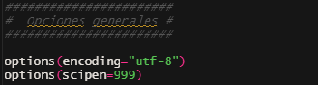
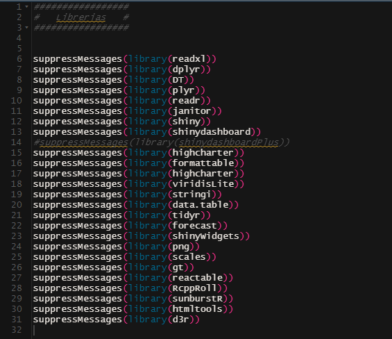
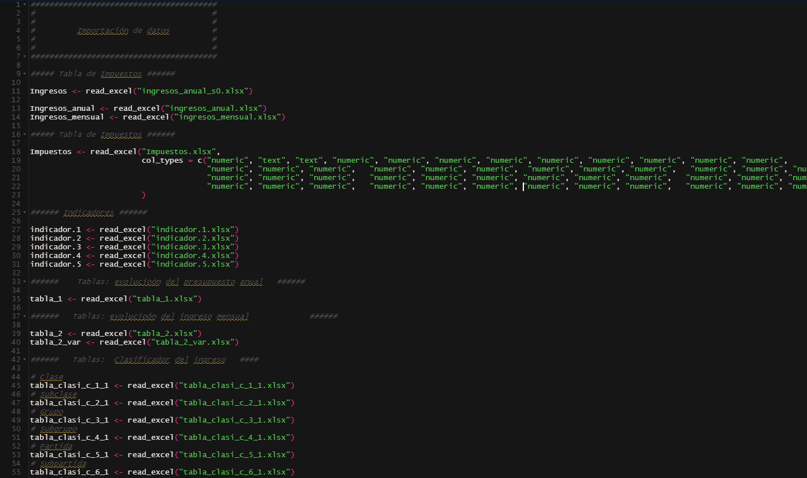

```{r setup, include=FALSE}
knitr::opts_chunk$set(echo = TRUE)
```


<style>
table {
background-color:#FFFFFF;
}
</style>

<style>
.list-group-item.active, .list-group-item.active:focus, .list-group-item.active:hover {
    background-color: darkblue;
}
</style>

<button onclick="document.body.scrollTop = document.documentElement.scrollTop = 0;" style="
    position: fixed;
    bottom: 5px;
    right: 40px;
    text-align: center;
    cursor: pointer;
    outline: none;
    color: #fff;
    background-color: #0A71A0;
    border: none;
    border-radius: 15px;
    
">Ir arriba</button>


El presente tema abarca los parámetros generales de un proyecto en R.  

Se abordarán los siguientes temas:


- ¿Qué entiende por parámetro en un proyecto de datos?
- ¿Qué se podría parametrizar?
- Opciones generales.
- Las libererías .
- ¿Los datos? 


Al finalizar la sesión, tendrá una noción de qué podría parametrizar en un proyecto de R-Shiny.


# 1. ¿Qué entiende por parámetro en un proyecto de datos?

Lo primero es preguntarse: ¿Qué es un parámetro en un proyecto informático?


Tomado de Wikipedia, **Parameter (computing programming)**

*En la programación computacional, un parámetro o un argumento formal es un tipo especial de variable que se usa en una subrutina para referirse a uno de los datos proporcionados como entrada a la subrutina. Estos datos son los valores de los argumentos (a menudo llamados argumentos reales o parámetros reales) con los que se va a llamar/invocar a la subrutina. Normalmente se incluye una lista ordenada de parámetros en la definición de una subrutina, de modo que, cada vez que se llama a la subrutina, se evalúan sus argumentos para esa llamada y los valores resultantes se pueden asignar a los parámetros correspondientes*

Por lo tanto, un parámetro podría ser un llamado ya sea a un constante, un venctor, una matriz, un archivo de datos, una lista, una opción, una librería, o algo, que para una determinada rutina, puede utilizar las características de ese o esos paramétros.

¿Si fuimos suficientemente claros?


# 2. ¿Qué se podría parametrizar?

Pues, como se trato de abarcar en la respuesta, se podría parametrizar:

1. Opciones generales o glabales
2. Opciones específicas en cierta rutina
3. Constantes
4. Vectores 
5. Matrices 
6. Data frames
7. Listas
8. Imágenes 
9. Datos
10. Vídeos
11. Y muchas muchas cosas más....


# 3. Opciones generales.

Considero que los primeros parámetros generales que se pueden adecuar al proyecto están relacionadas con las opciones generales.

¿Qué son estas opciones?

Permita que el usuario configure y examine una variedad de opciones globales que afectan la forma en que R calcula y muestra sus resultados.

Hay opciones para  tales como add.smooth, CBoundsCheck, echo, encoding, expressions, etc.

En las referencias, los primeros dos enlaces posee la lista de todas las opciones del entorno de R.

En los proyectos de R, suelo utilizar solo estas dos opciones:



La primera es para que el encoding sea siempre UTF-8, y la segunda es para que los números posean un cierto redondeo con no muchos números después de la coma o punto


# 4. Las libererías.

Considero que las librerías también son párametros a los cuales se les puede identificar o llamar antes de comenzar el proceso en los datos.

Recordamos que en R, las librerías se utilizan para llamar a las funciones que llevaran a cabo el trabajo en la data.


En un código de proyecto de R, así suele verse la parte de las librerías.




# 5. Los datos.

Si bien es cierto que en un proceso los datos son variables, cada día se modifican, etc., el nombre de los archivos, tablas e indicadores que se pueden obtener
se pueden mantener estáticos.Por lo tanto podrían figurar como un parámetro.

Sin entrar en detalle de la parte de ETL, y todas las transformaciones que tuvieron que suceder para tener un archivo consolidado, un ejemplo de los datos 
como parámetros podría ser:



En el ejemplo, además de traer de forma de párametros a archivos de datos, tablas e indicadores, se pudo haber pensando en vectores, matrices y hasta listas.

Por lo tanto, se antes de crear el proceso o las rutinas de un proyecto, el parametrizar diversos aspector colabora mucho en el diseño del proyecto de
datos, y también el el proyecto Shiny.

# 6. Referencias. 

Pueden consultar los siguientes enlaces:

- https://www.rdocumentation.org/packages/base/versions/3.6.2/topics/options
- http://www.endmemo.com/r/options.php
- https://www.r-bloggers.com/2015/09/passing-arguments-to-an-r-script-from-command-lines/
- https://www.ge.com/digital/documentation/meridium/Help/V43050/Default/Subsystems/RScripts/Content/DefineParametersInRScripts.htm
- https://www.delftstack.com/howto/r/r-command-line-arguments/
- https://www.delftstack.com/howto/r/r-command-line-arguments/
- https://swcarpentry.github.io/r-novice-inflammation/05-cmdline/index.html
- https://stackoverflow.com/questions/2151212/how-can-i-read-command-line-parameters-from-an-r-script
- https://community.rstudio.com/t/running-r-script-in-rstudio-with-arguments/85003


