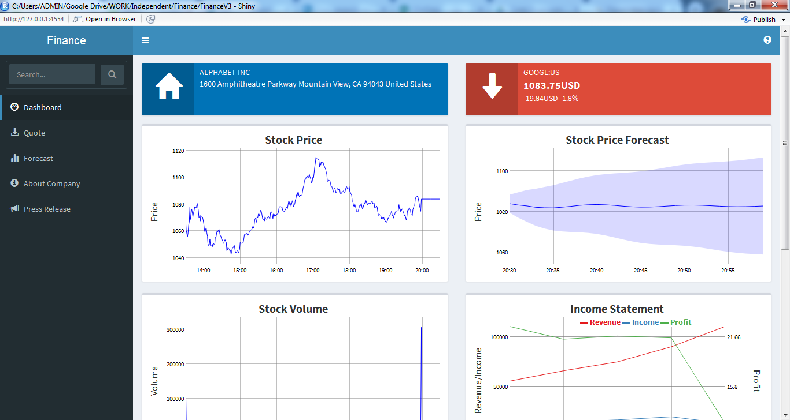
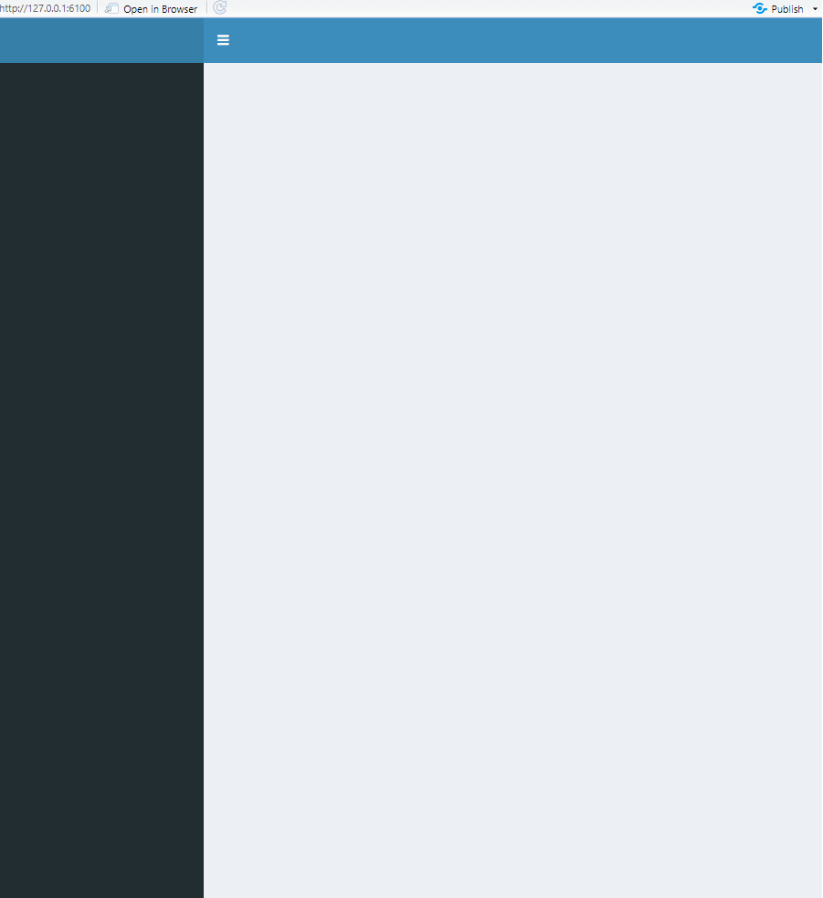
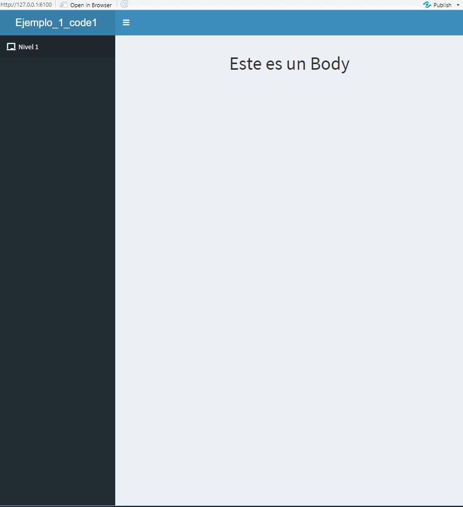
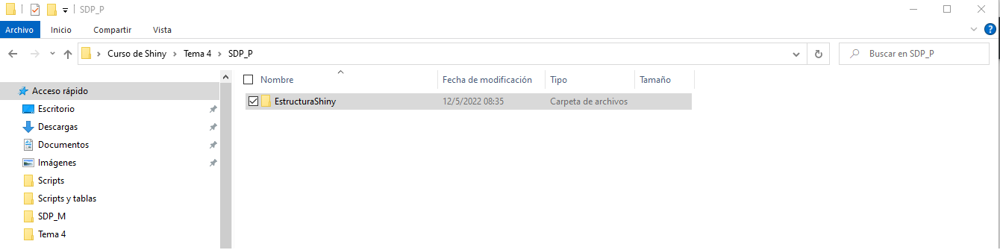
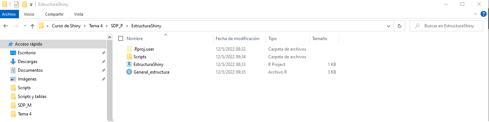

```{r setup, include=FALSE}
knitr::opts_chunk$set(echo = TRUE)
```


<style>
table {
background-color:#FFFFFF;
}
</style>

<style>
.list-group-item.active, .list-group-item.active:focus, .list-group-item.active:hover {
    background-color: darkblue;
}
</style>

<button onclick="document.body.scrollTop = document.documentElement.scrollTop = 0;" style="
    position: fixed;
    bottom: 5px;
    right: 40px;
    text-align: center;
    cursor: pointer;
    outline: none;
    color: #fff;
    background-color: #0A71A0;
    border: none;
    border-radius: 15px;
    
">Ir arriba</button>


El presente tema abarca la estructura de un código Shiny, y sobre todo el de un Shiny dashboard.  

Se abordarán los siguientes temas:


- Shiny vs Shiny Dashboard
- La estructura del Shiny Dashboard
- Header
- Sider
- Body
- El ui
- Server


Al finalizar la sesión, tendrá una noción de la estructura de un Shiny dashboard.


# 1. Shiny vs Shiny Dashboard

Anunciamos que se enseñará un Shiny dashboard, el cual es una evolución del primer tipo, el Shiny standar. Veamos un ejemplo de cada tipo

Un Shiny estándar:

https://shiny.rstudio.com/gallery/ncaa-swim-team-finder.html
https://gpilgrim.shinyapps.io/SwimmingProject-Click/?_ga=2.45741025.457797747.1652199195-300298753.1643674583

Un Shiny dashboard:

https://shiny.rstudio.com/gallery/nz-trade-dash.html
https://shiny.rstudio.com/gallery/soil-profiles.html

Antes de seguir: ¿en qué creen que se diferencias ?

Pues, si bien en cierto que un Shiny normal permite ir de una ventana u opción a otra, y cambiar en sí el contexto visualizado, 
el Shiny Dashboard se caracteriza por poseer una columna matriz. 



Tal vez por un asunto de "rutina", un dashboard es considerado un como tal, cuando suele tener un columna matriz a su izquierda o derecha, permitiendo
al usuario navegar en distinta información.

¿No se pueden crear sitios de navegación en el Shiny Standar? 

La respuesta es si.

¿Entonces por qué crear la versión del Shiny dasboard?

Creo que la respuesta se debe a que es más cómun navegar con columnas matrices. Además, cuadno se tiene un Dashboard con mucha información,
suele ser bastante más comodo si se hace de tal manera.

# 2. Shiny flexdashboard

Al agregar Shiny a un flexdashboard, puede crear dashboards que permitan a los espectadores cambiar los parámetros subyacentes y ver los resultados de inmediato, o que se actualicen de forma incremental a medida que cambian sus datos subyacentes (consulte reactiveFileReader y reactivePoll). Esto se hace agregando runtime: shiny a un tablero flexible estándar y luego agregando uno o más controles de entrada y/o expresiones reactivas que impulsan dinámicamente la apariencia de los componentes dentro del tablero.

El uso de Shiny con flexdashboard convierte un informe R Markdown estático en un documento interactivo. Es importante tener en cuenta que los documentos interactivos deben implementarse en un servidor Shiny para compartirlos ampliamente (mientras que los documentos R Markdown estáticos son páginas web independientes que se pueden adjuntar a correos electrónicos o servir desde cualquier servidor web estándar).

Tenga en cuenta que el paquete shinydashboard proporciona otra forma de crear paneles con Shiny.

Algunos ejemplos:

https://jjallaire.shinyapps.io/shiny-crandash/
https://jjallaire.shinyapps.io/shiny-kmeans/

Este tipo se puede exportar en la web, pero creo que no permite tanta flecibilidad y orden como un Shiny dashboard (creo...).

# 3. Shiny Dashboard + (Shiny DashboardPlus)

Para el caso del Shiny Dashboard, en el 2019, surgió la mejora del Shiny DashboardPlus:

Vean un poco este modalidad: 

https://dgranjon.shinyapps.io/shinydashboardPlusDemo/

Qué es lo que nos aporta el Shiny DashboardPlus en comparación a la versión estándar del Shiny:

1. Otra barra o columna matriz a la derecha.
2. Mejorar en las cajas. 
3. Nuevas cajas o boxes.
4. Buenos elementos de las cajas. 
5. Nuevos botones.
6. Más flexibilidad e interacción entre los elementos
7. Etc., etc., etc.,...

Una lista completa de todos sus elementos con las diferentes actualizaciones, se encuentran en el siguiente enlace:

https://rinterface.github.io/shinydashboardPlus/news/index.html

En la actualidad, para el paquete de shinydashboardPlus, estamos en la versión 2.0.4.9000

¿Por qué no suelo utilizar el Shiny DashboardPlus?

En ciera época, algo no me funcionaba, y tuve que volver a la versión base. Sin embargo, y sin duda alguna, es la mejor versión para desarrollar un dashboard. 

# 4. La estructura del Shiny Dashboard.

Ahora, si, manos en la Matrix de R. 


Cualquier proyecyo Shiny Dashboard posee, cómo mínimo, los siguientes elementos:

- Header
- Sider
- Body
- Ui
- Server

Veamos lo siguiente estructura de código, en donde el material se obtiene del siguiente sitio:

https://rinterface.github.io/shinydashboardPlus/reference/index.html 


##  Header

Es el nombre que se le suele dar al encabezado, suele estar en la parte superior izquierda.

```{r eval=FALSE}
dashboardHeader(
  ...,
  title = NULL,
  titleWidth = NULL,
  disable = FALSE,
  .list = NULL,
  leftUi = NULL,
  controlbarIcon = shiny::icon("cogs"),
  fixed = FALSE
)
```


https://rinterface.github.io/shinydashboardPlus/reference/dashboardHeader.html 

##  Sider

El sider es Una barra lateral del dashboard que  generalmente contiene un sidebarMenu, aunque también puede contener un sidebarSearchForm u otras entradas de Shiny.

Se puede ver como una columna matriz de un menú que le permite al usuario navegar de un lugar a otro.

```{r eval=FALSE}
dashboardSidebar(
  ...,
  disable = FALSE,
  width = NULL,
  collapsed = FALSE,
  minified = TRUE,
  id = NULL
)
```

También está el **updateSidebar()**, pero esta no la veremos.

##  Body

Es el contenido del Dashboard. Se puede pensar como el que al usuario le interesa consultar.

```{r eval=FALSE}
 dashboardBody(
 
)
```

Esta función, con sus distintos componentes, será vista en próximos capítulos.

##  Ui

Ui, que quiere decir, **user interface**, son todo los elementos visibles en la parte del front end, o que el usuario puede ver.

La parte del ui retoma los elementos del header, sider y el body.

```{r eval=FALSE}

dashboardPage(header, 
              sidebar, 
              body, 
              title = NULL, 
              skin = c("blue", "black", "purple", "green", "red", "yellow")
              )

```

En rdocumentation.org se dice del dashboardPage()

*This creates a dashboard page for use in a Shiny app.*

Lo veo como la parte de front-end

##  Server

El server, es toda la parte funciona ocupalte que permite presentar cuadros, gráficos, etc.

Es conocida como la parte de back-end.

```{r eval=FALSE}

server <- function(input, output) {
  
  
}

```

En el server haremos uso de todo lo aprendido en R, para hacer uso o salida (output), en el body.

Esta sección será abordada mejor en los próximos capítulos.  

## Run App

Finalmente, el RunApp, es la función que nos permite lanzar la aplicación del Dashboard. 

Esta suele contener los elementos del front-end (el ui) y del back-end.


```{r eval=FALSE}

shinyApp(ui, server)

# o 

require(shiny)


x <- system("ipconfig", intern=TRUE)
z <- x[grep("IPv4", x)]
ip <- gsub(".*? ([[:digit:]])", "\\1", z)


# print(paste0("the Shiny Web application runs on: http://", ip, ":7701/"))

runApp( launch.browser=TRUE, port = 7702, host = ip)
  
  
}

```

La funcionalidad del runApp o lanzar la App a la web, será vista con mayor detalle al final del curso. 

## Veamos una primera forma básica de una Shiny

Ver el código **Shinydashboard_code1.R**



Analicemos un poco el código.

## Veamos una segunda forma básica de una Shiny

Ver el código **Shinydashboard_code2.R**



Analicemos un poco el código. 

¿Cuál es la principal gran diferencia con respecto al código anterior?

¿Qué les parece mejor?

Y, según el capítulo de proyectos, ¿no les parece que podría haber una mejor forma ?

## Shiny a partir de un proyecto

Analicemos y lancemos la aplicación de Shiny para el proyecto SDP_p



Veamos el proyecto en sí:



Abramos el proyecto, y veamos sus distintas partes. 

# 5. Referencias. 

Pueden consultar los siguientes enlaces:

- https://shiny.rstudio.com/gallery/
- https://shiny.rstudio.com/gallery/soil-profiles.html
- https://shiny.rstudio.com/gallery/teach-physiology.html
- https://shiny.rstudio.com/gallery/rd-business-game.html
- https://shiny.rstudio.com/gallery/radiant.html
- https://shiny.rstudio.com/gallery/radiant.html
- https://rstudio.github.io/shinydashboard/structure.html
- 


