```{r setup, include=FALSE}
knitr::opts_chunk$set(echo = TRUE)
```


<style>
table {
background-color:#FFFFFF;
}
</style>

<style>
.list-group-item.active, .list-group-item.active:focus, .list-group-item.active:hover {
    background-color: darkblue;
}
</style>

<button onclick="document.body.scrollTop = document.documentElement.scrollTop = 0;" style="
    position: fixed;
    bottom: 5px;
    right: 40px;
    text-align: center;
    cursor: pointer;
    outline: none;
    color: #fff;
    background-color: #0A71A0;
    border: none;
    border-radius: 15px;
    
">Ir arriba</button>


El presente tema abarca la forma de operar del Shiny para poder presentar los resultados en un Dashboard.  

Se abordarán los siguientes temas:


- Visualizar información en el Shiny
- Ejemplo: una tabla y un gráfico
- Esquema general de como funcional 
- Etapa 1: El pedido.
- Etapa 2: La elaboración.
- Etapa 3: la entrega.
- Caso de visualiación de la tabla
- Caso de visualiación del gráfico

Al finalizar la sesión, tendrá una noción del funcionamiento del Shiny para presentar sus distintos resultados.

# 1. Visualizar la información en el Shiny.

El Shiny es la herramienta para presentar y visualizar los resultados de un proceso de datos.

En próximos capítulos veremos 

En próximos capítulos nos enfocaremos en como estructurar la vista de información para la vista de los usuarios (la sección del ui, sobre
todo del body), y lo que se puede llegar a presentar en estos (el server).

El presente establece las bases para entender el funcionamiento de Shiny:

- El Front-end: consiste en la conversión de datos en una interfaz gráfica para que el usuario pueda ver e interactuar con la información de forma digital.

- El Back-end:  es la parte de la app que el usuario final no puede ver. Su función es acceder a la información que se solicita, a través de la app, para luego combinarla y devolverla al usuario final.


Por lo tanto, veremos que para poder obtener y presentar un Dashboard como el siguiente:

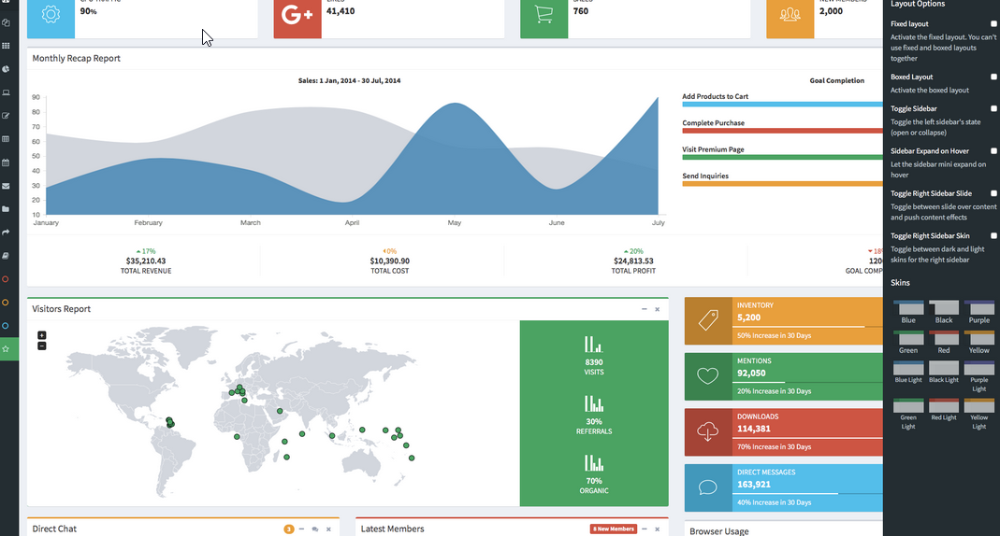

Debemos pasar por la configuración especial de dos elementos del Shiny:

- El ui, compuestos por el header, sider y ante todo del body (Front-end).
- El server (Back-end).

Realizaremos una aplicación pequeña, o un pequeño Dashboard, para abordar lo anterior. 


# 2. Ejemplo: una tabla y un gráfico

Para entender el funcionamiento del Shiny, sea el siguiente Dashboard, bajo la carpeta del 5 tema, y el proyecto General.p


En este poseemos tres páginas o vistas del Dashboard:

- La página de "Visualizar" (imagen anterior).
- La pagina de "Cuadro".
- La página de "Gráfico".

El cuadro el es siguiente:

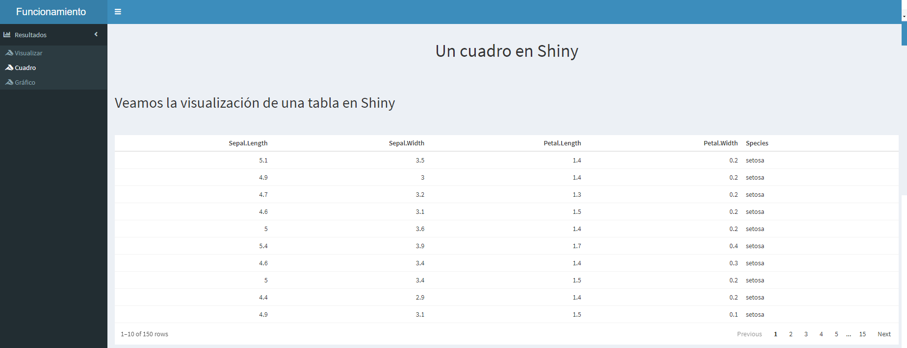

El gráfico el es siguiente:

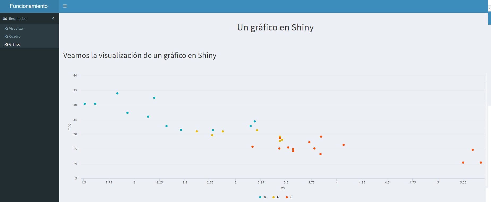

A partir de este Dashboard, nos interesará explicar cómo funcional el proceso de visualización de la información en Shiny.

# 3. Esquema general del funcionamiento.

Inmaginémobos que estamos en un restaurente, y nos gustaría pedir algo de tomar (cuadro), y algo comer (gráfico).

Normalmente, una vez dentro del restaurente, lo primero sería pedir lo que deseamos (Etapa 1), luego, en la parte de productos o preparación, algo que muchas veces no solemos ver en un restaurente, estarán elaborando nuestro pedido (Etapa 2), para finalmente, treaerlo a nuestra mesa, y así poder consumirlo (Etapa 3).

En la presentación y visualización de los resultados en Shiny, estos suelen llevar el siguiente esquema:


- Etapa 1: solemos solicitar en el body lo que deseamos visualizar o presentar, ya sea en términos de datos, o siemplemente para expresar o presentar 
algún contenido. A esta Etapa 1, la llamaremos como *el pedido*.
- Etapa 2: una vez especificado lo que deseamos obtener, en el server solemos crear o insertar las especificaciones del código R para así obtener el resultado 
deseado o lo anterior. Por ejemplo, si deseamos un histograma, cuadro o mapa, es en esta estapa que debemos especificar el código R para así llegar a obtenerlo. 
A esta Etapa 2, la denominaremos como *la elaboración*.
- Finalmente, lo siguiente será presentar o visualizar lo que habiamos solicitado en *el pedido*, lo cual fue exitosamente construido en *la elaboración*, para así ser
*la entrada* del producto. 

Por lo tanto, estas tres etapas son las que componentes el funcionamiento del Shiny. 

Veamos cada una de estas en el Dashboard creado para este capítulo.

Supongamos que deseamos en un restaurante pedir que nos traigan una bebida (cuadro) y una plato de comida (gráfico).


# 4. Caso de visualiación de la tabla.

Entramos al restaurante, y se nos apatece algo de tomar (el cuadro). 

¿Cómo sería en la programación y la visualización del Shiny?

## Etapa 1: el pedido.

Lo primero es hacer el pedido, y esto se realiza desde el Script, o la sección del body.

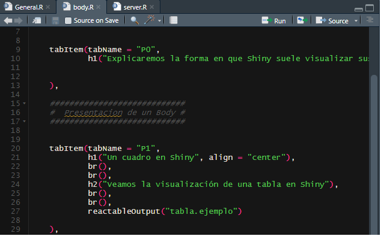
Para soliciar un cuadro en una determinada sección del body, llamaos al cuadro mediante la función:

**reactableOutput()**

Esta función tiene dos particularudades:

1. Utilizo la familia de tablas de la función *reactable()*
2. Para darle el carter de un código de salida Shiny, se puede poner la parte *...Output()*

POr lo tanto, con la función de **reactableOutput()**, fue que solicité el fresco, y en este caso, el cuadro.

También, nótese que lo que ordenamos de tomar, lleva por nombre *"Tabla.ejemplo"*. 

Habiendo solicitado, lo siguiente es ir al interior del restaurante, la cantina XD, o lo que sea, para ir a traer el refresco.

En este caso, el interior sería ir al al server.

## Etapa 2: la elaboración.

Debemos preparar lo que se nos solicitó en el body, y esto sería el *"Tabla.ejemplo"*.

En el server se vería de la siguiente forma:

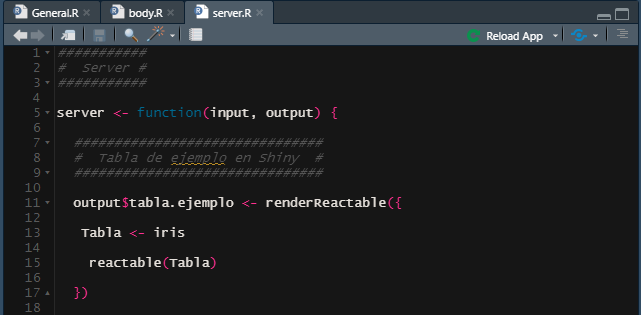

Más adelante veremos una tema exclusivo del server, por ahora nos concentraremos exclusivamente en como se elabora lo que se solició en el body.

En este parte, hay 5 características esenciales:

1. Lo que se prepara, se genera en términos de una asignación de R. 

Con esto, ven que pedimos una tabla, y esa tabla sería de la forma 

**elemento_shiny  <- tabla**

2. La asignación de ese pedido siempre tiene la forma iniciar de 

*output$pedido_del_body*

En este caso, nosotros pedimos *"Tabla.ejemplo"*, por lo que vamos a poner en la asignación,  será 

*output$tabla.ejemplo*

output, dado que al final de cuentas es la salida o la visualición que deseamos ver en el Front-end, y *$tabla.ejemplo*, dado que es el llamado inicial que realizamos en el body.


3. La función de llamado a lo solicitado en el body.


En el body, se manifestó que se deseaba visualizar una tabla reactable(), para presentar los resultados. Y se utilizó la función **reactableOutput()**, para lo anterior. En este caso, se puede decir que :

a. **reactableOutput()** : por favor traeme esto.

b. *renderReactable({   })* : claro, ya te preparo lo que me pediste.

Vemos que la preparación es una dupla de lenguaje exclusivo del Shiny:

- Para pedir utilizamos el **...Output()**
- Para preparar o realizar el pedido el *render...()*

Por lo que, a la hora de crear un insumo o vista de Shiny, se necesita el **...Output()** en el body, y el *render...()*, en el server.


4. Las funciones de Shiny ----> **({  })**

Normalemnte, en el lenguaje de R, una determinada función como  data.table(), reactable(), lm(), etc., el llamado de una función suele estar contenida por:

- **nombre_función()**

Esto es, el llamado suele utilizar los paréntesis redondos **( )**

En Shiny, el llamado de una función, suele ser especificada por **({  })**

Por lo tanto, la diferencia radica que para hacer el llamado de un elementro se suele introducir las duplas *{ }*

Al introducir esto dentro de los **( )**, y obtener por lo tanto **({  })**, el sistema sabe que vamos hacer uso de una funcionalidad exclusiva del Shiny.

5. Agregar el código de R, como si fuera cualquier código de R normal.

Para llamar la tabla anterior, el código de R sería 

```{r eval=FALSE}

 Tabla <- iris
    
    reactable(Tabla) 

```

Pero, ahora que estamos en el ambiente de Shiny, ese mismo código debe ir situado en el llamado a un elementro de Shiny, por lo que debería ser situado entre la función Shiny especificada, para el elemento de salida que se desea. Esto sería:


```{r eval=FALSE}

output$tabla.ejemplo <- renderReactable({ 
    
   Tabla <- iris
    
    reactable(Tabla) 
    
  })

```


## Etapa 3: la entrega.

Una vez configurada el código del body para el pedido, y el código del server en la prepración, finalmente se tiene la entrega, lo cuál sería la visualización correcta de lo que solicitó.

Si pediste una piña colada, pues se espera que esta llegue a la mesa, para asi consumirla. 

Veamos el resultado.

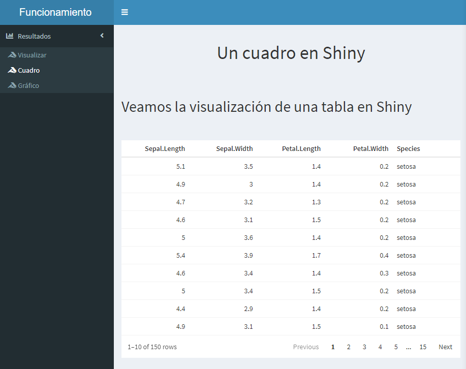

# 4. Caso de visualiación del gráfico.

Ahora pidamos algo de comer. 

¿Qué les parece una hamburguesa? 

En este caso, un gráfico.

## Etapa 1: el pedido.

Para pedir la hamburguesa, el código se vería como sigue. 

Esto lo escribimos desde el Script del body.

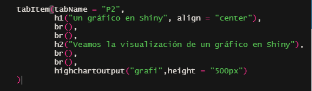

Nótese que:

- Se solicitó mediante **highchartOutput()**, el pedido de lo que deseamos
- Es un elemento o gráfico highcharter()
- Esa solicitud de ese gráfico, se llama *grafi*


## Etapa 2: la elaboración.

En la elaboración, tenemos lo siguiente:

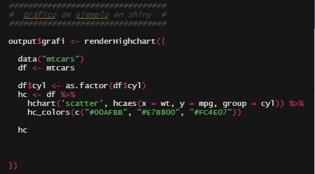

Al igual que antes, nótese que:

- La elaboración se realiza en forma de una asignación **output$grafi <- renderHighchart({**
- El nombre de esa elabición, al igual que el pedido, se llama *grafi*, y está de la mano del output$, dado que es lo que se 
presentará en el Front-end.
- Se utiliza la función **renderHighchart({ })** para crear el elemnto Shiny.

Recordar que se debe de tener la dupla  **...Output()** en el body, y el *render...()*, en el server.

- La función Shiny, para invocar al gráfico, además de utilizar la función específica de **renderHighchart({ })**, se  suele ser especificada por **({  })**

- Finalmente, la especificado de la función de Shiny, debemos poner nuestro código específico de R: 


```{r eval=FALSE}

 data("mtcars")
    df <- mtcars
    
    df$cyl <- as.factor(df$cyl)
    hc <- df %>% 
      hchart('scatter', hcaes(x = wt, y = mpg, group = cyl)) %>%
      hc_colors(c("#00AFBB", "#E7B800", "#FC4E07"))
    
    hc


```

Y dentro del contexto de Shiny, sería poner:

```{r eval=FALSE}

  output$grafi <- renderHighchart({
    
    #### Parte de R 
    
    data("mtcars")
    df <- mtcars
    
    df$cyl <- as.factor(df$cyl)
    hc <- df %>% 
      hchart('scatter', hcaes(x = wt, y = mpg, group = cyl)) %>%
      hc_colors(c("#00AFBB", "#E7B800", "#FC4E07"))
    
    hc
    
    ##### Fin de la parte de R
    
  })
  


```

## Etapa 3: la entrega.


Finalmente, la entrega del gráfico se vería de la siguiente forma:

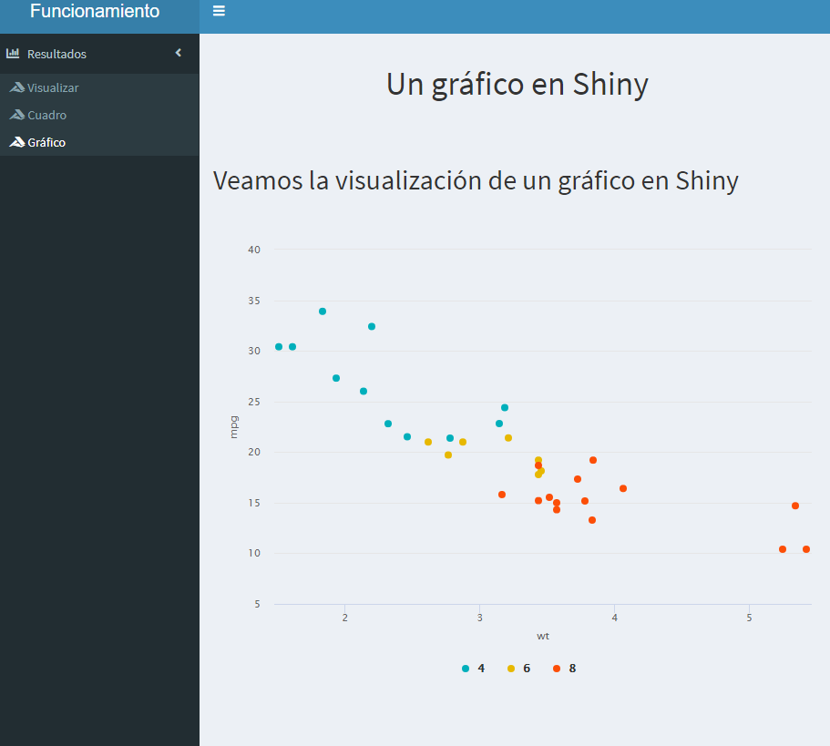

Esta sería la visualización en el Shiny.

# 6. Varios pedidos, varias entregas, pero todas realizadas en un mismo lugar --> server sigue siendo el mismo.

Cuando llegamos a un restaurante, solemos tomar una mesa, y así sucede con las demás personas.

La preparación de comida y las bebidas, suelen estasn en el mismo lugar. 

Así suele ser la disposición en un código de Shiny, entre el body y el server. 

Veamos el body del presente ejemplo:


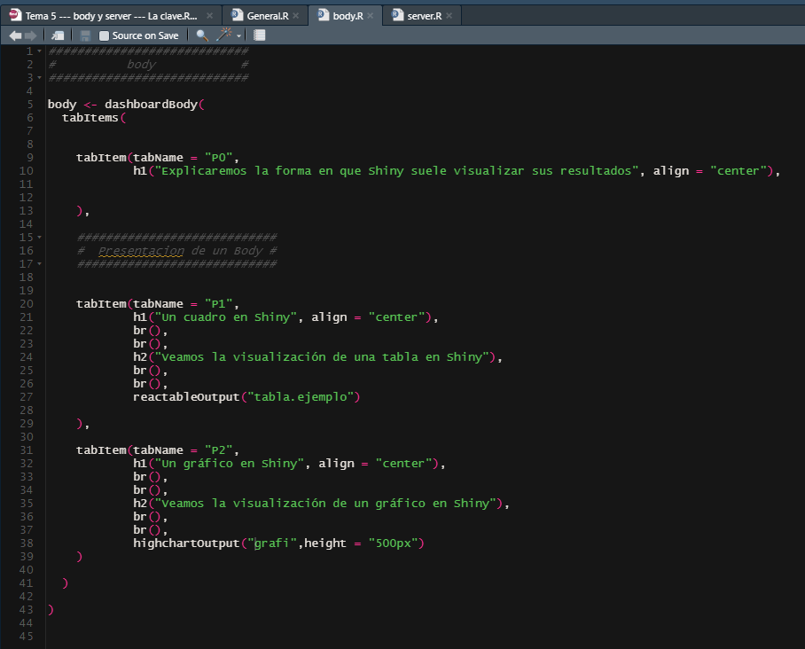

¿Qué podemos constatar sobre las distintas salidas?

- Los apartados del body están determinados por la configuración del sider.
- El llamado se realice mediante un ...**...Output()**, pero que estuvo de ante mano establecido entre la conjución del sider-body.

Ahora veamos el server:  

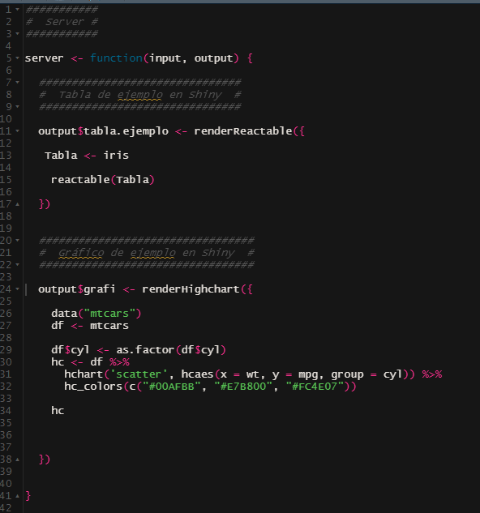
El server se prepara bajo una misma mesa, y esta es el código **server <- function(input, output) { }**

Luego, en este mismo lugar, los diferentes platos o bebias se suelen componer de 

*output$...  <- render....({      })*
    
Y, lo que solicitamos o preparamos, se prepara o se escribe siempre entre el **server <- function(input, output) { }**

Para medido nuevo, igualmente, se utiliza la estructura *output$...  <- render....({      })*, sin importar si está antes, después o al final,
dado que es código de R que igualmente se deberá compilar.
    

# 7. Referencias. 

Pueden consultar los siguientes enlaces:

- https://engineering-shiny.org/structuring-project.html
- https://shiny.rstudio.com/reference/shiny/1.6.0/
- https://shiny.rstudio.com/reference/shiny/1.0.5/
- https://mastering-shiny.org/scaling-functions.html
- https://stat545.com/shiny-tutorial.html
- http://zevross.com/blog/2016/04/19/r-powered-web-applications-with-shiny-a-tutorial-and-cheat-sheet-with-40-example-apps/


