```{r setup, include=FALSE}
knitr::opts_chunk$set(echo = TRUE)
```


<style>
table {
background-color:#FFFFFF;
}
</style>

<style>
.list-group-item.active, .list-group-item.active:focus, .list-group-item.active:hover {
    background-color: darkblue;
}
</style>

<button onclick="document.body.scrollTop = document.documentElement.scrollTop = 0;" style="
    position: fixed;
    bottom: 5px;
    right: 40px;
    text-align: center;
    cursor: pointer;
    outline: none;
    color: #fff;
    background-color: #0A71A0;
    border: none;
    border-radius: 15px;
    
">Ir arriba</button>


El presente tema abarca la forma de operar del Shiny para poder presentar los resultados en un Dashboard.  

Se abordarán los siguientes temas:


- El Front- end del Shiny. 
- Los elementos más destacados del Shiny
- Las evoluciones con el Shiny Dashboard Plus.


Al finalizar la sesión, tendrá una noción del funcionamiento del Shiny para presentar sus distintos resultados.

# 1. El Front-end principal del Shiny: el body.

Actualmente están visualizando el Front-end de un Shiny Dashboard. Veamos algunos ejemplo según los siguientes enlaces:

https://shiny.rstudio.com/gallery/ 

http://shiny.rstudio-staging.com/gallery/superzip-example.html

Caso 1: Análisis en el trading de Nueva Zelanda.

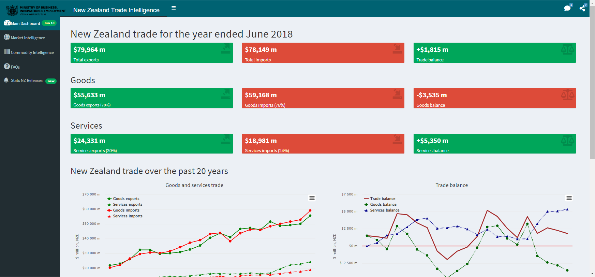

Caso 2: El registro de salud de un perro.

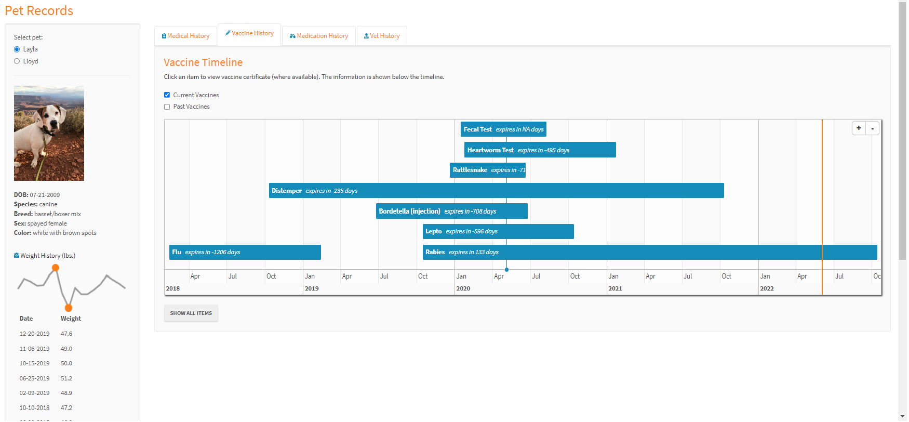

La principal vista de un Shinydashboard siempre será los elementos dentro del body, y en este capítulo aprenderemos como es que este se suele estructurar.

Hacemos la salvedad que, el curso está orientado y organizado bajo el Shinydashboard, pero su versión más actual, el ShinydashboardPlus brinda aún más opciones
y mejoras a tomarse en cosideración.

Este no será visto en datelle, pero sí presentado.


# 2. Los elementos más destacados del Shinydashboard.

## 2.1 Los boxes.

Los recuadros son los componentes principales de las páginas del Dashboard. Se puede crear un cuadro básico con la función *box()*, y el contenido del cuadro puede ser (la mayoría) cualquier contenido del Shiny UI.

En un Dashboard típico, estos cuadros se colocarían dentro de *fluidRow()* (veremos más sobre el diseño del tablero más adelante):

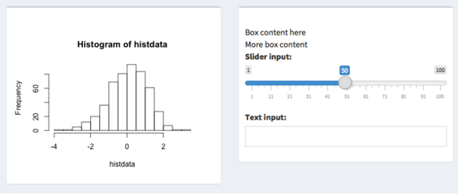

Cajas basicas

Los cuadros pueden tener títulos y colores de barra de encabezado con las opciones de título y estado. Aquí se muestran los diferentes estados posibles.

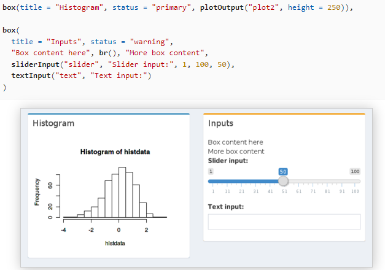

Color y título del encabezado del cuadro

Puede tener encabezados sólidos con solidHeader=TRUE y mostrar un botón en la parte superior derecha que colapsará el cuadro con collapsible=TRUE:

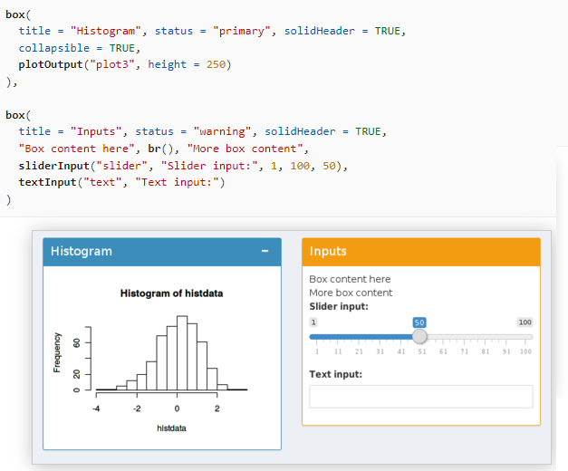

Encabezado sólido y colapsado

Si desea que los cuadros no tengan una barra gris o de color en la parte superior, use solidHeader=TRUE y no proporcione un valor para el estado.

Sin barra de color

Finalmente, también es posible tener un fondo sólido, con la opción de fondo. Los diferentes colores posibles se muestran aquí.

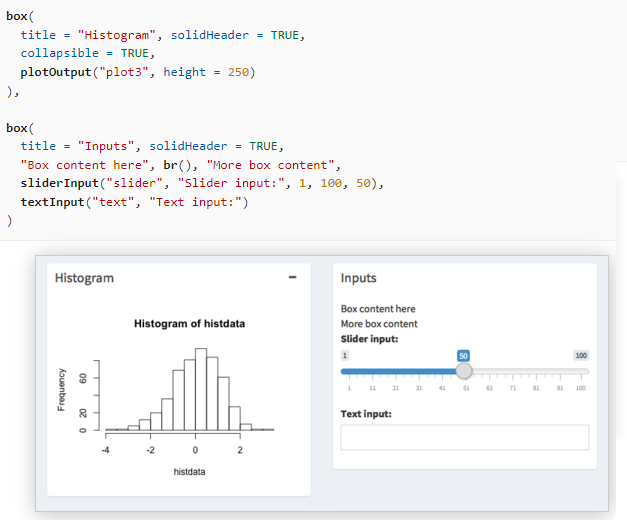

También, se puede optar por tener un color en el Background.

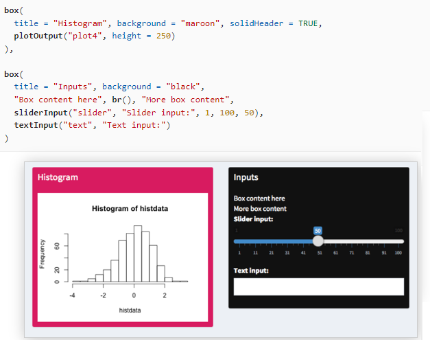


## 2.2 El tabBox.

Si desea que un cuadro tenga pestañas para mostrar diferentes conjuntos de contenido, puede usar un tabBox().

Cajas con pestañas

El código para generar esta aplicación se encuentra a continuación. Un tabBox es similar a un tabsetPanel de Shiny en el sentido de que toma tabPanels como entradas, le permite elegir qué pestaña se selecciona y se le puede asignar una identificación. Si la identificación está presente, puede acceder a qué pestaña se selecciona desde el servidor; en el siguiente ejemplo, se accede con input$tabset1.

Un tabBox también tiene similitudes con un cuadro normal de shinydashboard, en el que puede controlar la altura, el ancho y el título. También puede elegir de qué lado aparecen las pestañas, con el argumento lateral. Tenga en cuenta que si side="right", las pestañas se mostrarán en orden inverso.

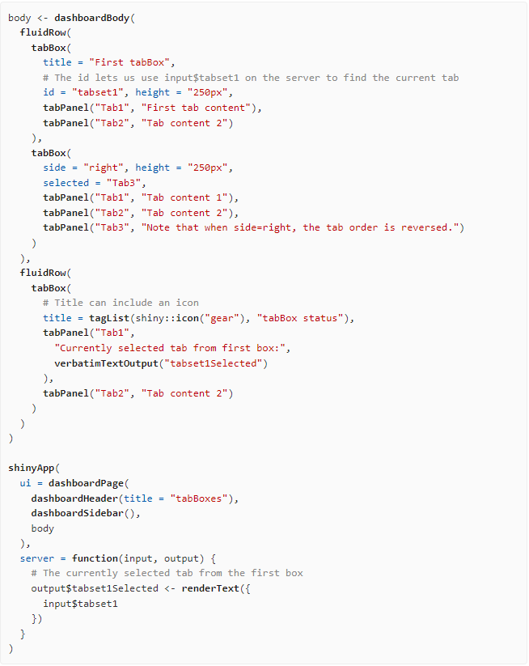

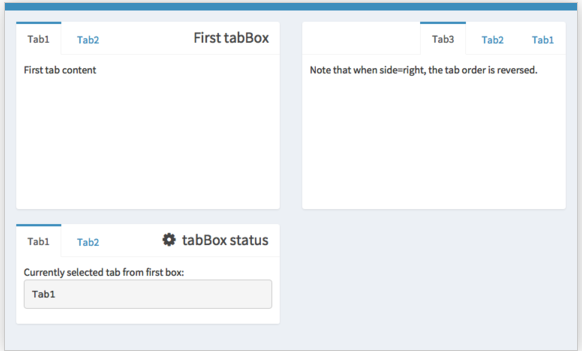

## 2.3 El infoBox.

Hay un tipo especial de cuadro que se utiliza para mostrar valores numéricos o de texto simples, con un icono. Aquí hay unos ejemplos:

Cuadros de información

El código para generar estos cuadros de información se encuentra a continuación. La primera fila de infoBoxes usa la configuración predeterminada de fill=FALSE, mientras que la segunda fila usa fill=TRUE.

Dado que el contenido de un infoBox generalmente será dinámico, shinydashboard contiene las funciones auxiliares infoBoxOutput y renderInfoBox para contenido dinámico.

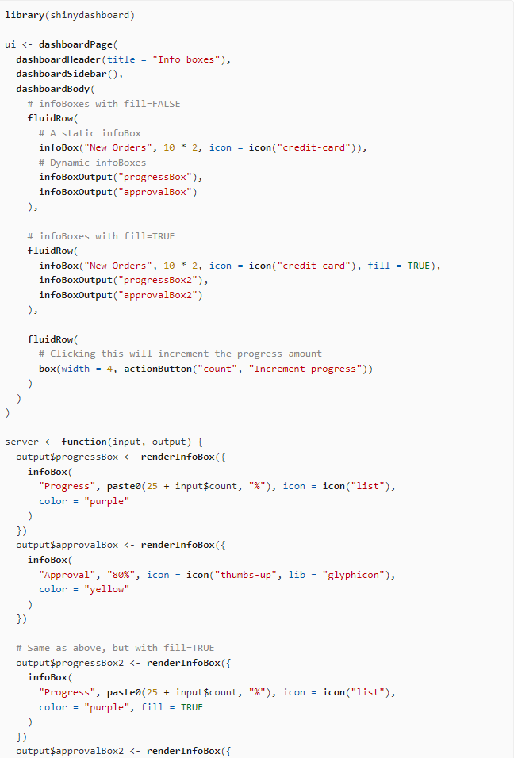

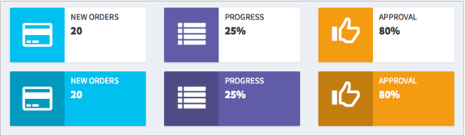

## 2.4 El valueBox.

Los valueBoxes son similares a los infoBoxes, pero tienen una apariencia algo diferente.

Cuadros de valor

El código para generar estos valueBoxes se encuentra a continuación. Al igual que con los infoBoxes anteriores, algunos de estos valueBoxes son estáticos y otros son dinámicos.

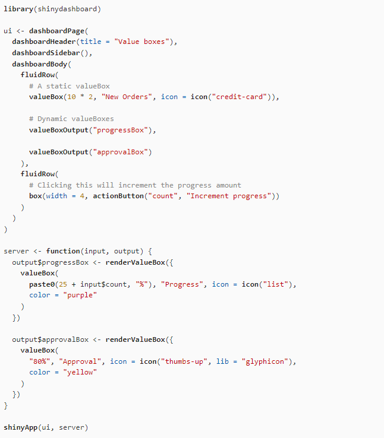
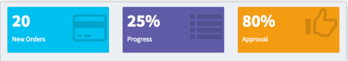


## 3.1 Los Layouts.

El diseño de las cajas requiere un poco de conocimiento del sistema de diseño de cuadrícula Bootstrap. El cuerpo se puede tratar como una región dividida en 12 columnas de igual ancho y cualquier número de filas, de altura variable. Cuando coloca un cuadro (u otro elemento) en la cuadrícula, puede especificar cuántas de las 12 columnas desea que ocupe. En esta captura de pantalla, la primera fila de cuadros tiene cada uno 4 columnas de ancho, y la segunda columna de cuadros tiene cada uno 6 columnas de ancho.

En términos generales, hay dos formas de diseñar cajas: con un diseño basado en filas o con un diseño basado en columnas.

### 3.1.1 Diseño basado en filas.

En un diseño basado en filas, los cuadros deben ir en una fila creada por *fluidRow()*. Las filas tienen un ancho de cuadrícula de 12, por lo que un cuadro con ancho = 4 ocupa un tercio del ancho, y un cuadro con ancho = 6 (el valor predeterminado) ocupa la mitad del ancho.

Con un diseño basado en filas, la parte superior de los cuadros de cada fila estará alineada, pero es posible que la parte inferior no, depende del contenido de cada cuadro. Un diseño basado en filas podría verse como se mostrará más adelante.

Diseño basado en filas

Este código es el andamiaje básico para estas tres filas de cajas:

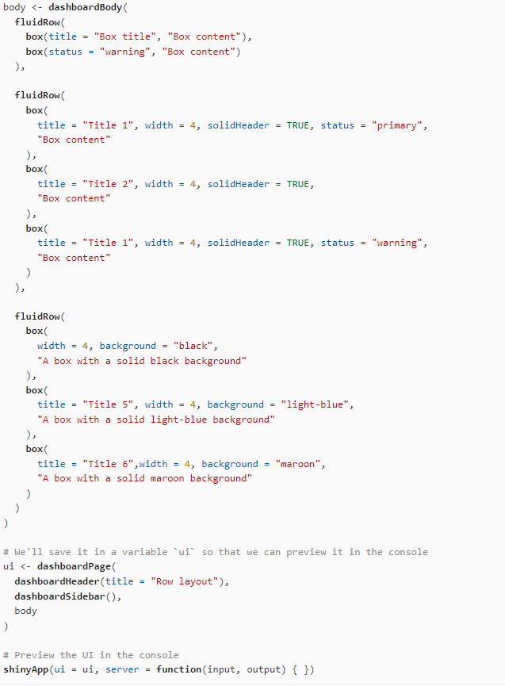

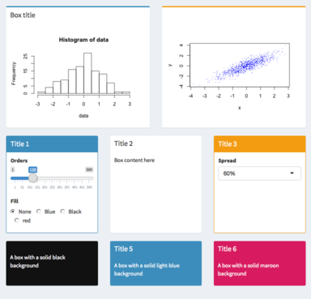

Es posible forzar que todas las cajas tengan la misma altura, configurando la altura. A diferencia del ancho, que se establece mediante la cuadrícula Bootstrap de 12 anchos, la altura se especifica en píxeles. (Esta diferencia se debe a que el diseño HTML/CSS maneja el ancho y el alto de manera diferente. Desafortunadamente, no hay una forma sencilla de obtener alturas de columna iguales con Bootstrap).

Por ejemplo: 

**box(title = "Box title", height = 300, "Box content"),..**

Si establecemos la altura de todas las cajas, podemos obtener un tablero como este (diseño basado en filas con altura fija):


### 3.1.2 Diseño basado en columnas.

Con un diseño basado en columnas, primero se crea una columna y luego coloca cuadros dentro de esas columnas.

El siguiente código es el andamiaje básico para este diseño basado en columnas. Observe que dentro de fluidRow, hay columnas con un ancho específico, y luego cada uno de los cuadros en la columna tiene ancho = NULL.

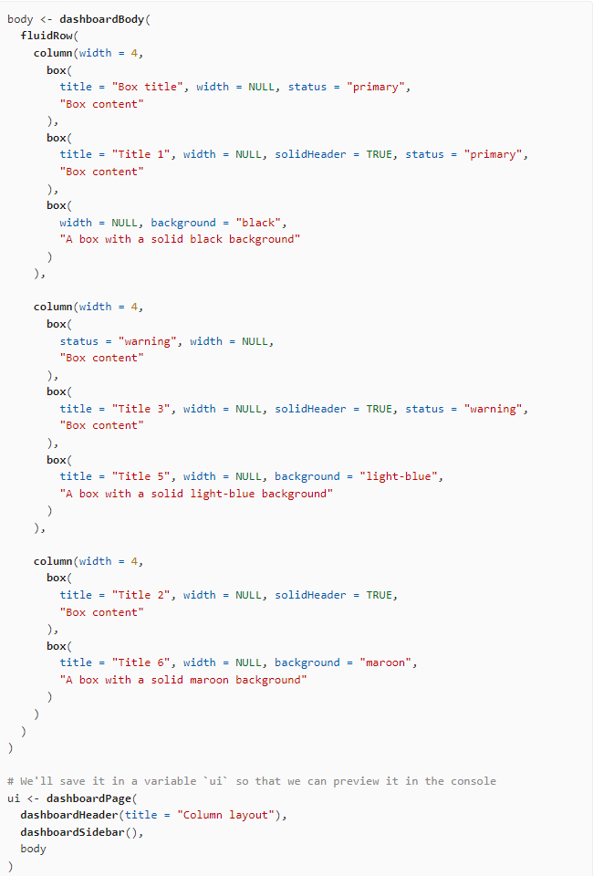


## 3.2 Hacer un mix de las filas y columnas.

También es posible usar una combinación de filas y columnas. En este ejemplo, los dos cuadros superiores están en fila y el resto en columnas. Este es el andamiaje para este diseño mixto:

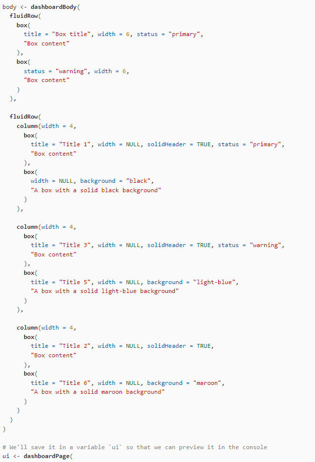

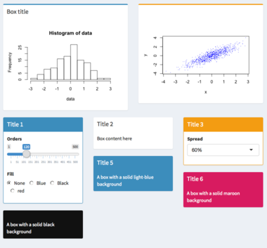

# 3. Las mejoras en el Shiny Dashboard Plus

## Primera versión del ShinydashboardPlus

Luego de un tiempo, y con las mejoras que se han realizado a los Front-end de los distintos lenguajes de programación, se creó en el 2019 la versión del ShinyDashboardPlus. 

Veamos el siguiente enlace:

https://dgranjon.shinyapps.io/shinydashboardPlusDemo/

Este lo veremos un poco en detalle.

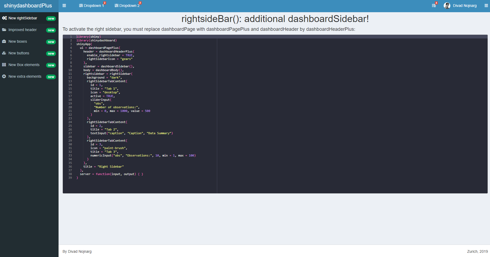

El ShinyDashboardPlus tuvo bastante deficiencias, y poco a poco estas se fueran cubriendo hasta dar nacimineto a la versión del *ShinydashboardPlus versión 2.0.0*

Veremos un poco las novedades y aspectos principales que esta versión posee.

## 3.0 Elementos del Shinydashboard vs. ShinydashboardPlus versión 2.0.0.

Veamos acá una tabla comparativa:

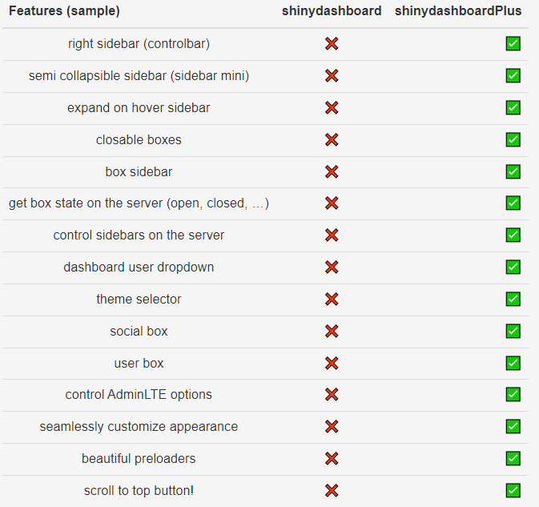
Veamos, una a una, las principales características novedosas que esta versión trae al Shiny.

## 3.1 Mejoras en las cajas.

https://rinterface.github.io/shinydashboardPlus/articles/improved-boxes.html

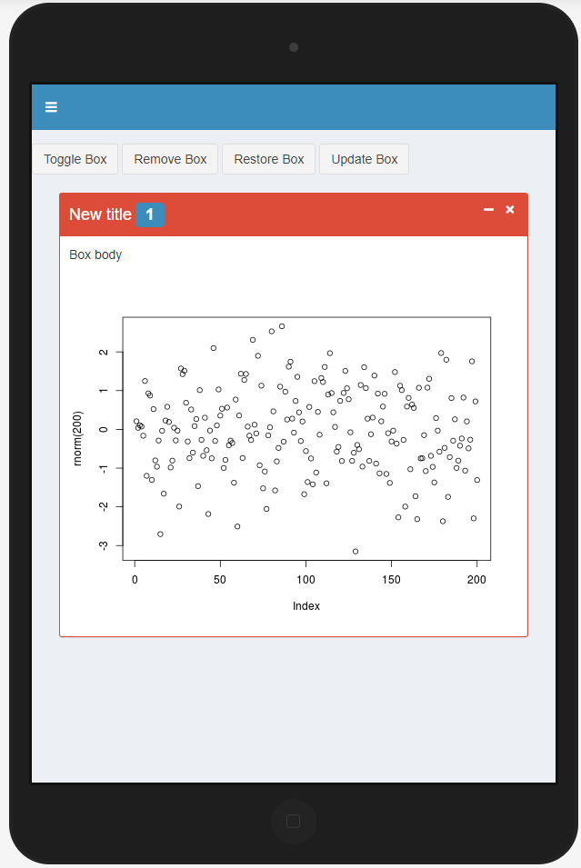

## 3.2 Elementos de las cajas.

https://rinterface.github.io/shinydashboardPlus/articles/box-elements.html

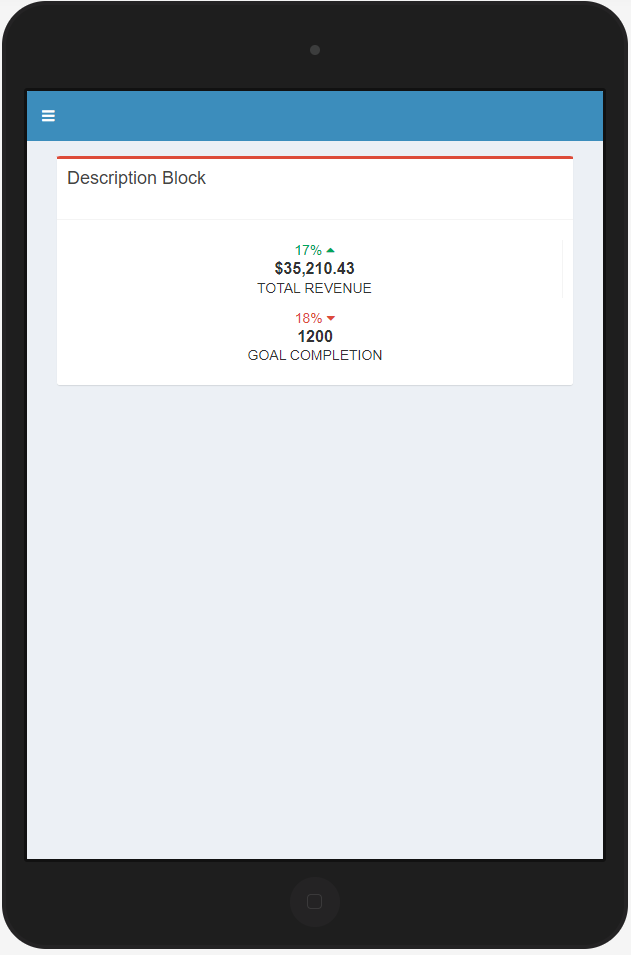

## 3.3 Elementos extras.

https://rinterface.github.io/shinydashboardPlus/articles/extra-elements.html


## 3.4 Elementros de estrucutas extras.

https://rinterface.github.io/shinydashboardPlus/articles/controlbar.html

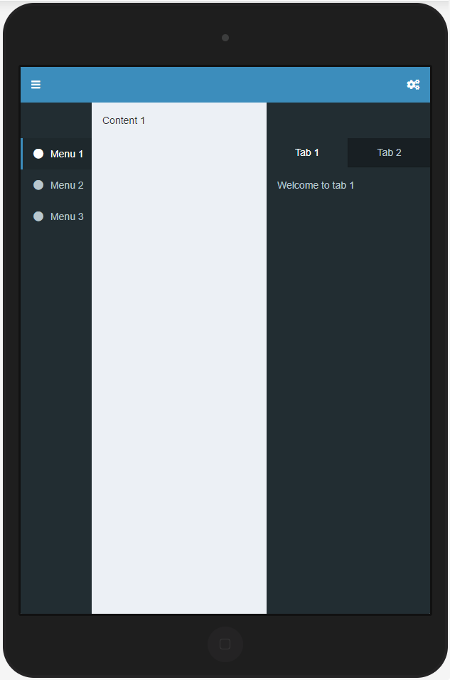
 
## 3.5 Mejoras de la apariencias.

https://rinterface.github.io/shinydashboardPlus/articles/more-skins.html

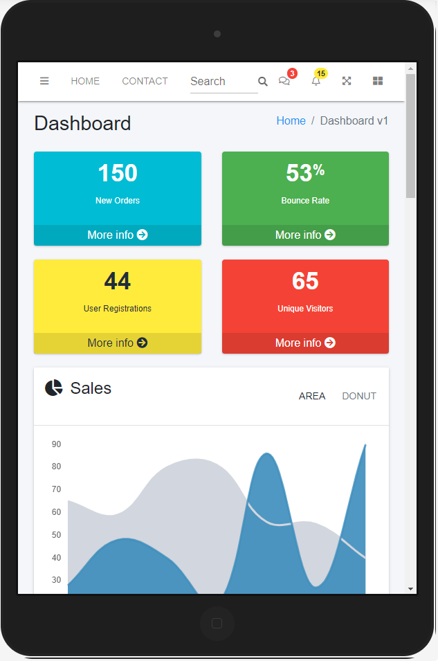

## 3.6 Elementos CCS para la recargar.

https://rinterface.github.io/shinydashboardPlus/articles/css-preloader.html

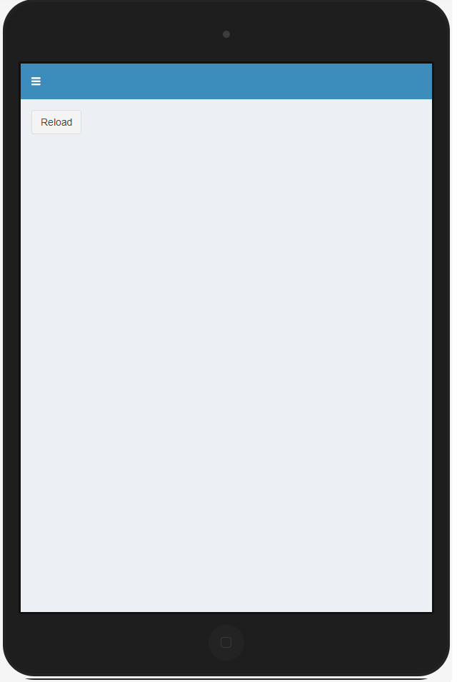

## 3.7 Elementos de encabezado mejorados

https://rinterface.github.io/shinydashboardPlus/articles/enhanced-header.html

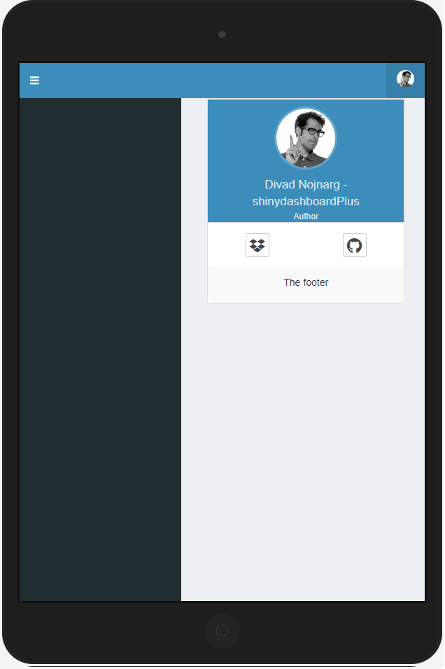

# 7. Referencias. 

Pueden consultar los siguientes enlaces:

- https://rstudio.github.io/shinydashboard/structure.html#body
- https://dgranjon.shinyapps.io/shinydashboardPlusDemo/
- https://rinterface.github.io/shinydashboardPlus/index.html 
- https://cran.r-project.org/web/packages/shinydashboard/shinydashboard.pdf
- https://community.rstudio.com/t/how-do-i-add-tabs-to-the-dashboardheader/39674
- https://rdrr.io/cran/shinydashboard/man/box.html
- https://towardsdatascience.com/how-to-make-impressive-dashboards-in-under-10-minutes-with-shiny-ad90e13bb123
- https://www.rdocumentation.org/packages/shinydashboard/versions/0.7.2/topics/box
- https://www.linkedin.com/pulse/building-interactive-dashboard-using-r-shinydashboard-rendy-kurnia
