```{r setup, include=FALSE}
knitr::opts_chunk$set(echo = TRUE)
```


<style>
table {
background-color:#FFFFFF;
}
</style>

<style>
.list-group-item.active, .list-group-item.active:focus, .list-group-item.active:hover {
    background-color: darkblue;
}
</style>

<button onclick="document.body.scrollTop = document.documentElement.scrollTop = 0;" style="
    position: fixed;
    bottom: 5px;
    right: 40px;
    text-align: center;
    cursor: pointer;
    outline: none;
    color: #fff;
    background-color: #0A71A0;
    border: none;
    border-radius: 15px;
    
">Ir arriba</button>


El presente tema abarca la funcionalidad del server y su accionar en el Shinydashboard.  

Se abordarán los siguientes temas:


- El Back- end del Shiny. 
- Un pedido, una única orden a ser entregada.
- Lo que podemos preparar en la sección del server.
- La opción del sesion en el server.


# 1. El Back-end del Shiny.

En el tema anterior vimos lo hermoso que es construir el Front-end o la parte visible del Shiny:


Cuando prendemos la luz de un cuarto, vemos que estan sencillo: oprimir el botón y ¡PUM!, se hizo la luz.

Lo que no valoramos es que hay todo un plan estructural y electrico para que eso pueda suceder. 

Los Back-end de cualquier tipo de App, poseen la misma temática: la estrucuta es el código.

En el Shinydashboard, realmente el Backend-End sería todo el código que escribimos, pero para poder obtener el resultado principal, que es lo que más nos interesa, 
esto se obtiene a traves de lo aprendido en el lenguaje de programación de R.

Este es un Back-end de un Shiny:


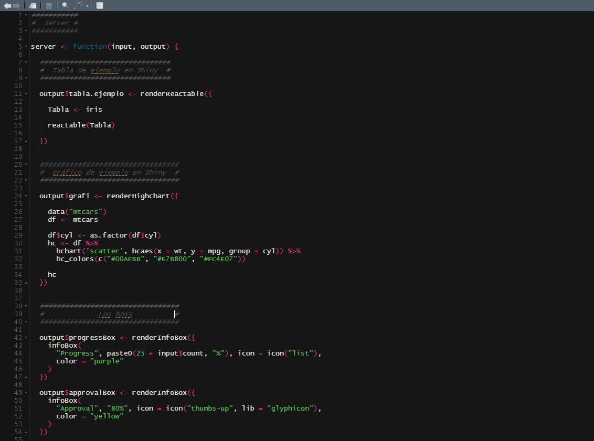

# 2. La combinación del ... Output("") y el render...({   })

Recormodes que en el tema 5 habías especificado el funcionamiento del Shiny:

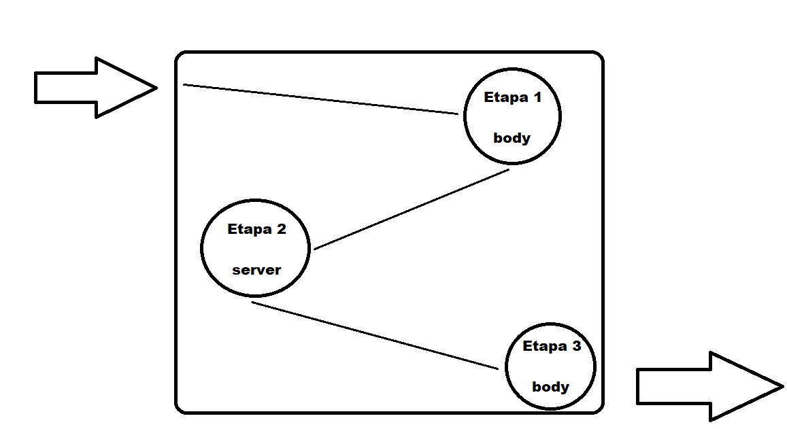

Para la presentación o la visualización de los resultados, habíamos establecido que el Shiny trabaja en 3 etapas:

- Etapa 1 *el pedido*: solemos solicitar en el body lo que deseamos visualizar o presentar, ya sea en términos de datos, o siemplemente para expresar o presentar 
algún contenido. 

- Etapa 2 *la elaboración*: una vez especificado lo que deseamos obtener, en el server solemos crear o insertar las especificaciones del código R para así obtener el resultado 
deseado o lo anterior. Por ejemplo, si deseamos un histograma, cuadro o mapa, es en esta estapa que debemos especificar el código R para así llegar a obtenerlo. 

- Etapa 3 *la entrega*: se presentará o visualizará lo que habiamos solicitado en *el pedido*, lo cual fue exitosamente construido en *la elaboración*, para así poder
entregar el producto. 

Recordemos nuestras dos representaciones, la tabular y la grárica 

Recordar que se debe de tener la dupla  **...Output()** en el body, y el *render...()*, en el server.

La parte del  **...Output()** es la que hace la solicitud o el pedido.

El *render....({      })* es quien elabora, en el server, el pedido solicitado en el body.

Finalmente, volvemos al **...Output()** para realizar la entrega de lo que se había solicitado en una primera instancia.

Por lo tanto, en Shiny, siempre que queramos pedir o realizar algún tipo de representación o vizualización analítica, debemos de conocer la dupla 

 **...Output()**  *<- render....({      })* 

Estas serán dos funciones inseparables del Shiny.  


# 3. Un pedido, una única orden a ser entregada.

En los temás 5 y 6, habíamos presentado una tabla y una gráfica. 

Sean las siguiente representaciones vistos en los temas anteriores.

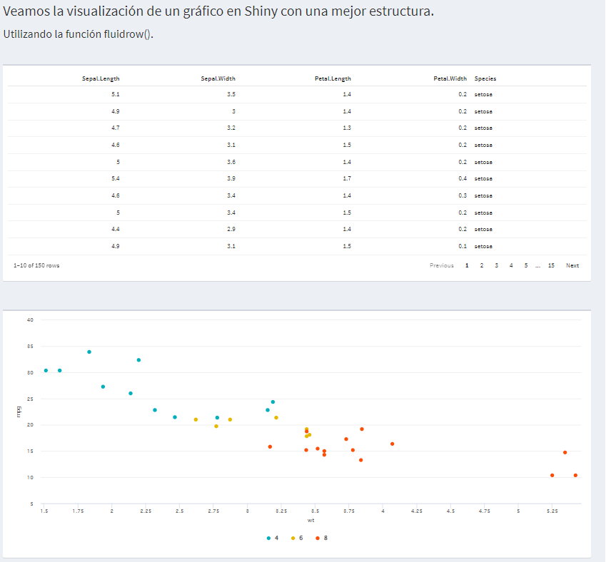

En el body solicitamos mediante al  **...Output()**  a la tabla, mediante el nombre de *"tabla.ejemplo1"* y solicitamos al gráfico mediante el nombre de *"grafi1"*.

En la sección del server, respeto a la elaboración del contenido que se lleva a cabo mediante el *<- render....({      })* , utilizamos la función **renderReactable({  })** para la
creación y la salida del *"tabla.ejemplo1"*, y utilizamos la función **renderHighchart({ })** para  la creación y la salida del *"grafi1"*.

Ahora, hay que recordar que cuando vamos a un restaurente, y queremos una pizza de jamón y hongos, un clinete pide esa pizza para esa persona exclusiva. Muchas personas querrán 
también una pizza, pero la pizza solicitada por la persona, será creada y entrega a pa persona XYZ. Si una persona XYF quiere una pizza, pues el restaurante deberá atender 
la solicitud, y luego, crear el producto para la persona XYF, y finalmente entregarle el producto.

Lo mismo funciona con el Shiny. 

Si se desea duplicar o asemejear la salida de un producto, estos **NUNCA** deberán ser nombrados de la misma forma  en el body, para el **...Output()**, como en la creación del server, para luego ser trasladado al body, mediante el **output$...**, especificado en el server.

Recordemos la estructura del **fluidrow()** y de los **box()**, del tema anterior:

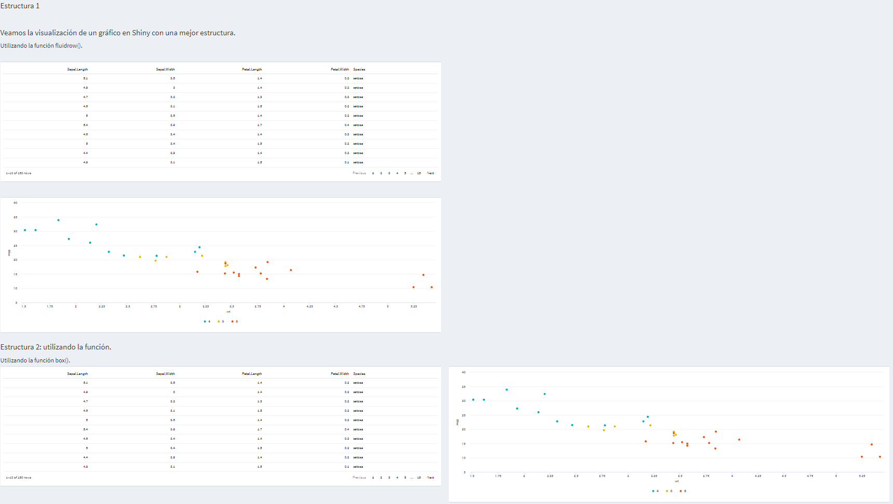

En esta sección del tema 6 habíamos explicado que los mismos elementos, pueden ser acomodados por filas, o por boxes. 

Usted se podrían estar preguntando: 

*¿Y si a los mismos elementos los nombramos igual en el* **output$.. del body y por ende el output$... del server**  *?*

Pues hagámoslo, y veamos el resultado:

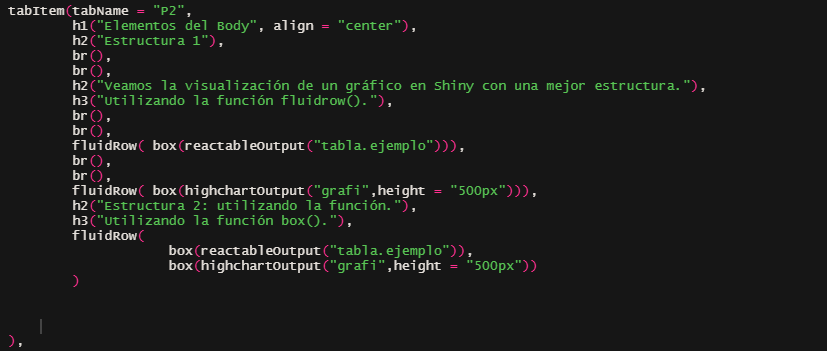
(vemos que la tabla se llama *tabla.ejemplo* y que el gráfico se llama *grafi*, y que en ambos casos queremos que estos sean
expuestos en una misma página del body, pero bajo un estrucutra de acomodo diferente.)

El resultado:

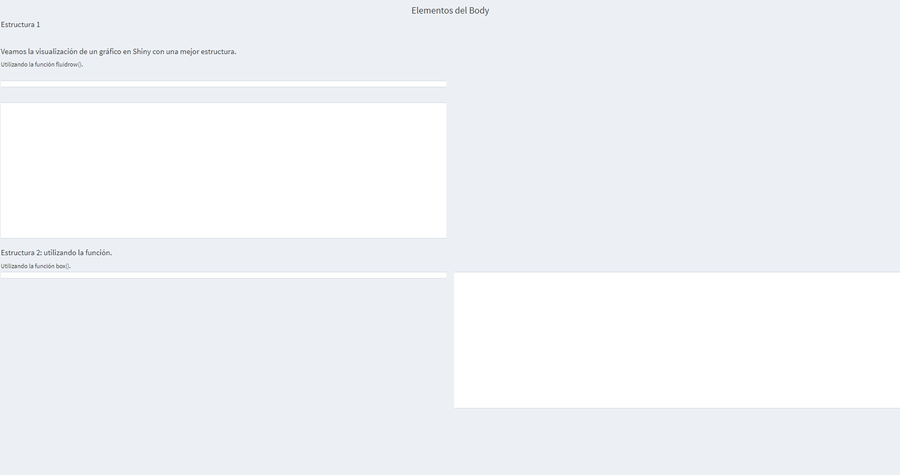

Shiny detecta un conflicto. Un  pedido es repetido, lo cual no sabe o no enfoca bien en dónde este debe ser presentado. Por lo que al final 
opta por no visualizar el resultado solicitado en un inicio. 

Para evitar lo anterior, cada pedido debe poseer nombres distintos. 

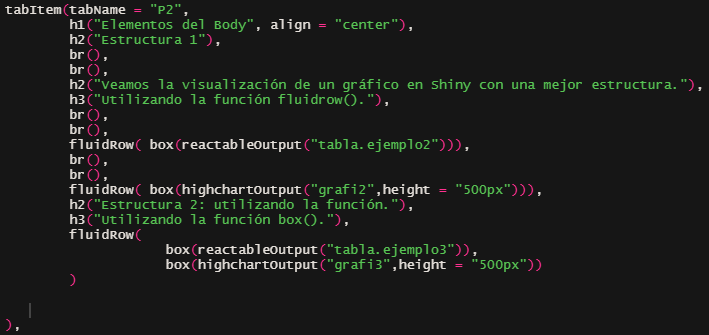
(vemos que la tabla se llama *tabla.ejemplo2* y *tabla.ejemplo3*, y que el gráfico se llama *grafi2* y *grafi3*, y que en ambos casos queremos que estos sean
expuestos en una misma página del body, pero bajo un estrucutra de acomodo diferente.)


**En Resumen:** a la hora de llamar o pedir distintos elementos en el Shiny, recordar para el **...Output() y el output$...**, estos deben llamarse de forma 
distinto, de lo contrario, Shiny encontrará un conflicto, y no visualizará o entregará los resultados solicitados. 

# 4. Elementos de visualización de la información

En el paso tema vimos como se puede presentar información como indicadores y otras cifras mediante las cajas y otros elementos, en este
veremos cuando se debe presentar aún más inforación

Las formas más clásicas para visualizar la infomración son las tablas y los gráficos, sin embargo se pueden optar por métodos 
como los mapas, redes, e interactuar con los datos mediante sistemas de filtraje e indicadores (esto se verá en el siguiente 
tema.)

Por ahora nos centratemos en los dos formas más comunes: tablas y gráficas.

Brindaremos los librerías que se suelen aplicar en R para sus representaciones más destacas, y su contra parte de cómo es que estas
se deben colocar en la parte del Back-end o el código (body y el server).


# 5. Las tablas en shiny.

¿Desea crear una tabla?

En R existen múltiples formas de crear tablas, y con el paso del tiempo, surgirán nuevas librerías, así con nuevas opciones 
para visualizar la información de forma tabular.

Cuado se crea una librería para crear tablas, dentro del ambiente de R, se piensa que estas igualmente  serán
exportas al Shiny, y se crean las respectivas funciones o API para la conexión con el sistema Shiny.

Véase a continuación el siguiente cuadro, con el tipo de tabla, y su contra parte con el Shiny:

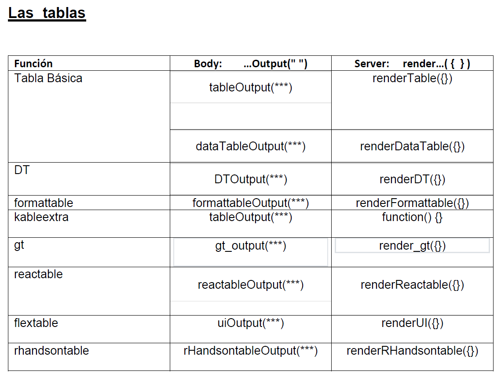

Se pueden optar por tablas bácias o por default, tablas de la librería DT, formattable, kableextra, gt, reactable, flextabla, rhandsontable, y muchas más. 

En el cuadro anterior vemos cómo es que lo debemos especficar en el pedido, o el body, y como es que sea se suele configurar en el server a la hora de prepararla.

Veamos unos ejemplos (solo la visualización, el código será expuesto en el Shiny del tema):

## Tabla normal

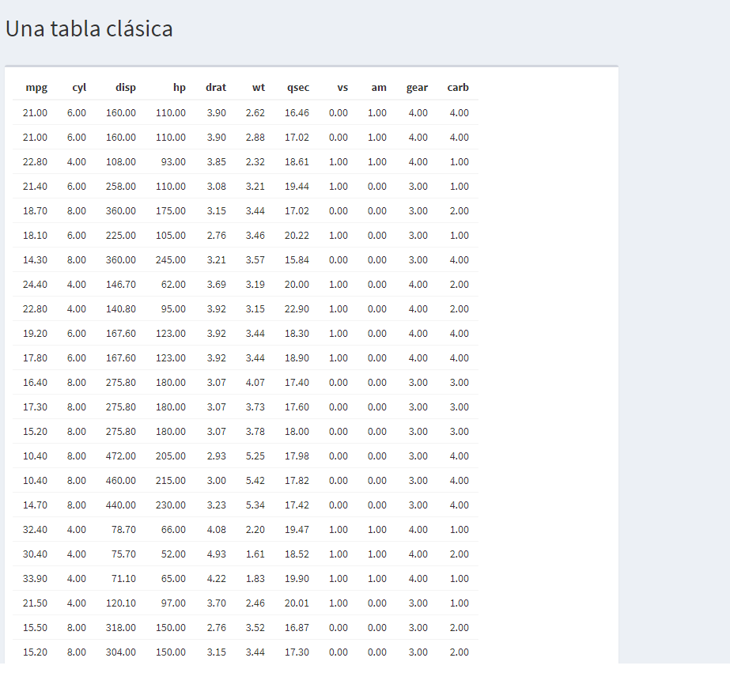

## Tabla DT

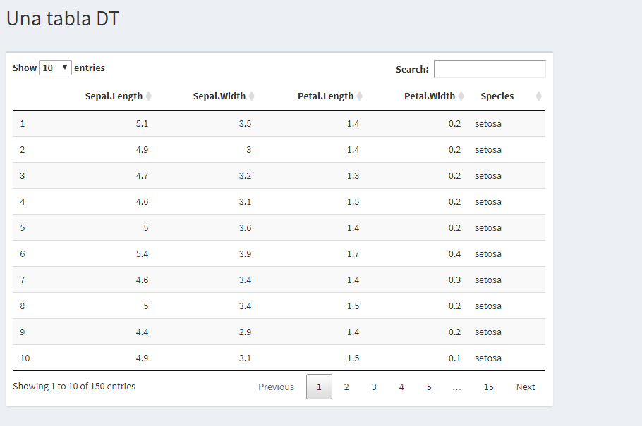

## Tabla gt


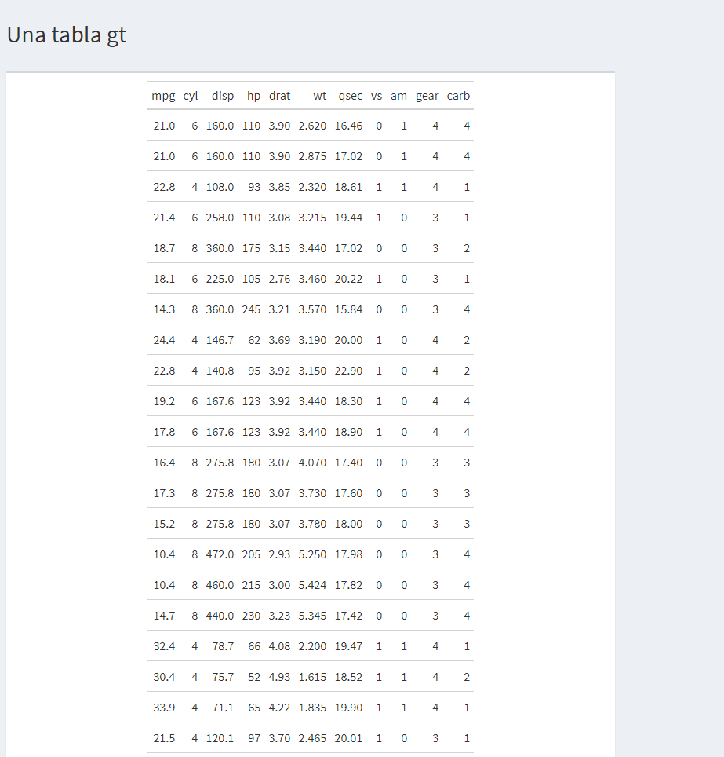

## Tabla reactable


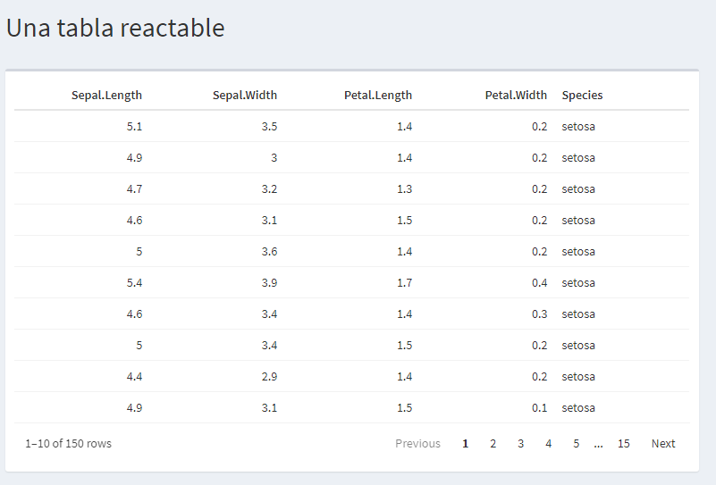

# 6. Los gráficos en shiny.

¿Desea crear un gráfico?

En R existen múltiples formas de crear grpaficos, y con el paso del tiempo, surgirán nuevas librerías, así con nuevas opciones 
para visualizar la información de forma gráfica.

Cuado se crea una librería para crear gráficos, dentro del ambiente de R, se piensa que estas igualmente  serán
exportas al Shiny, y se crean las respectivas funciones o API para la conexión con el sistema Shiny.

Véase a continuación el siguiente cuadro, con el tipo de gráfico, y su contra parte con el Shiny:

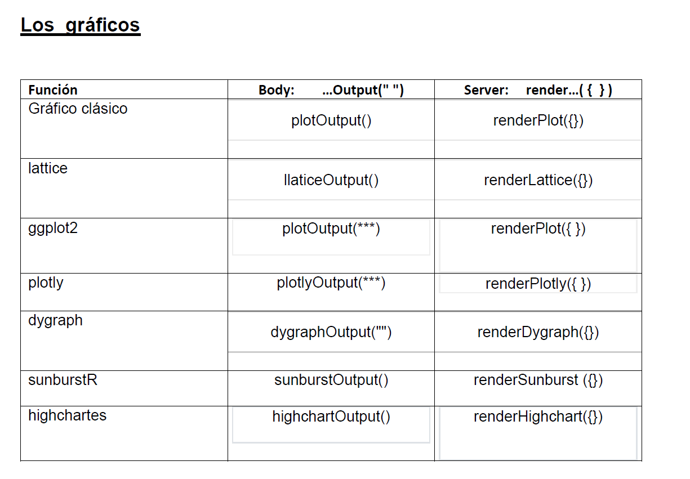

Se pueden optar por gráficos básicos o por default, gráficos de la librería lattice, ggplot2, plotly, dygraph, sunburstR, highcharter, etc.

En el cuadro anterior vemos cómo es que lo debemos especficar en el pedido, o el body, y como es que sea se suele configurar en el server a la hora de prepararla.

Veamos unos ejemplos (solo la visualización, el código será expuesto en el Shiny del tema):

## Gráfico clásico


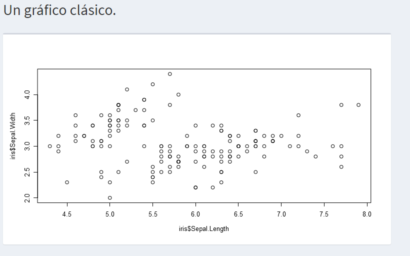

## Gráfico ggplot2

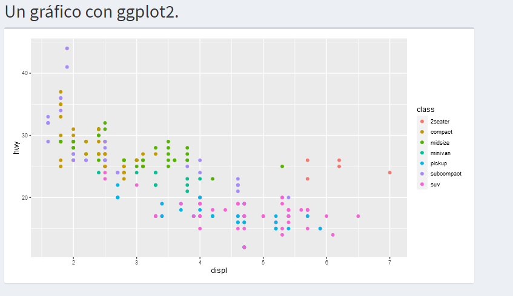


## Gráfico plotly


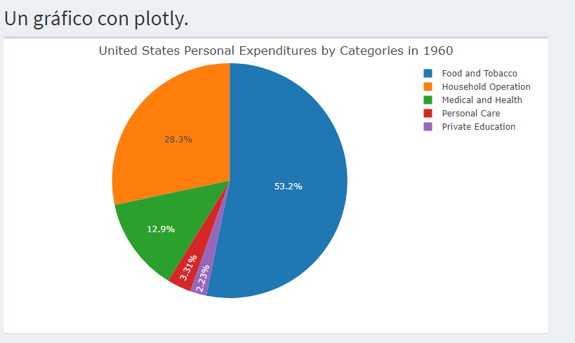

## Gráfico Dygraph

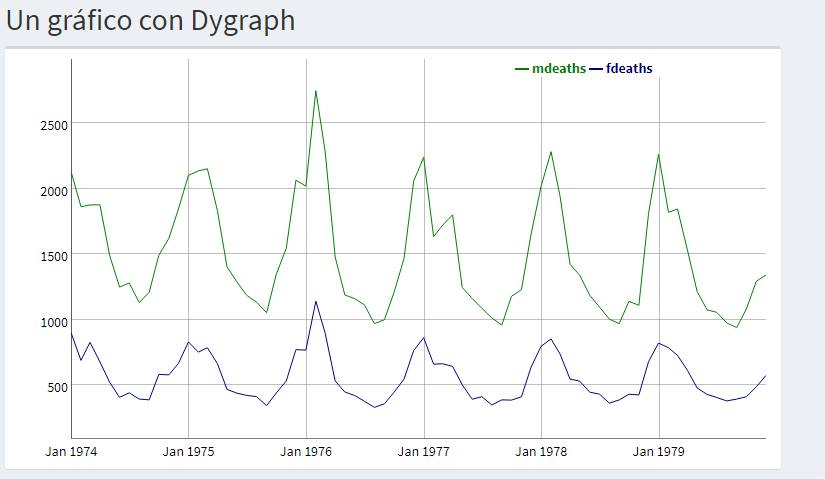


# 7. Otras elementos de visualización

Aunque el presente tema se enfoca más en la forma tabular y gráfica, se pueden optar por mapas, sistemas de redes, o cualquier objetivo que sea presentando dentro del ambiente de visualización de R. 

## Un mapa

Tomado del siguiente enlace:

https://www.datanovia.com/en/lessons/highchart-interactive-world-map-in-r/

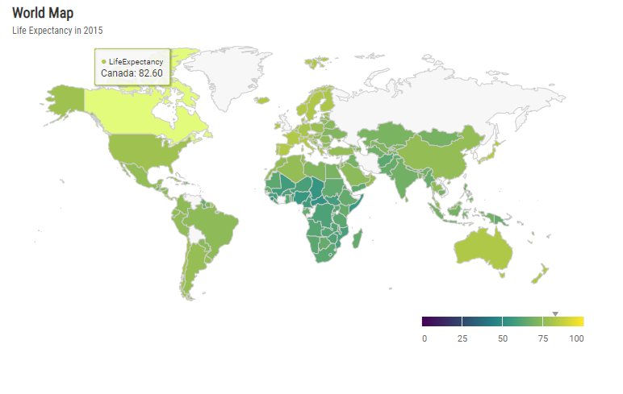

## Una red 

Tomado del siguiente enlace:

https://www.jessesadler.com/post/network-analysis-with-r/

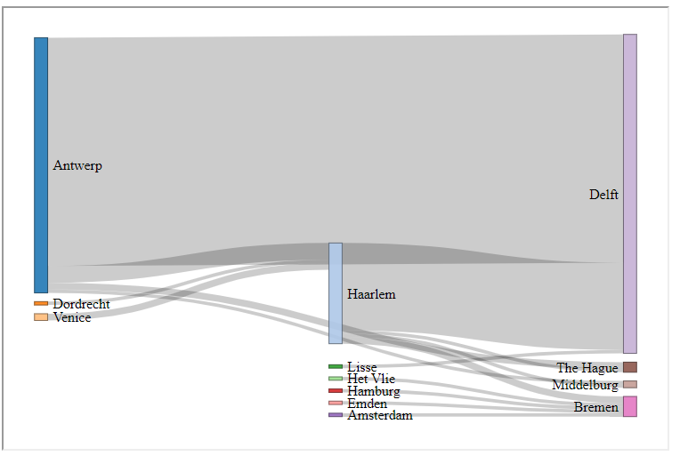


# 8. Referencias. 

Pueden consultar los siguientes enlaces:

- https://datanalytics.com/libro_r/shiny.html
- 
- https://appsilon.com/how-to-share-r-shiny-apps/
- https://yakdata.com/ultimate-guide-r-shiny-app-dashboards-2021-2/#foogallery-4591/i:4558
- https://epirhandbook.com/en/dashboards-with-shiny.html
- https://appsilon.com/how-i-built-an-interactive-shiny-dashboard-in-2-days-without-any-experience-in-r/
- https://shiny.rstudio.com/articles/dashboards.html
- https://www.datanovia.com/en/lessons/highchart-interactive-world-map-in-r/
- https://www.jessesadler.com/post/network-analysis-with-r/
